Simulation for Added Variable Plot then Variable Importance Scheme
================
Emerson Webb
3/14/2018

Next want to write a function which takes a dataframe and applys the added-variable plot then permute scheme to each predictor in the dataset.

``` r
#first need to take our data frame and make the p+1 datasets that we apply the random forest to

#itr_col takes as input an integer and removes that column from the dataset
#note: should make itr_col more robust
itr_col <- function(i, data){
  select(data,-i)
}

#df_combs is a function which takes as input a dataframe and returns all iterations of the
#dataframe where one predictor has been removed. Output is a p+1 element list where each element
#is a dataframe with the ith variable removed. the last element of the list is the entire dataframe
df_combs <- function(data){
  p <- ncol(data)-1
  df.list <- map(1:p, itr_col, data = data)
  df.list[[p+1]] <- data
  df.list
}

#extract_rf_pred is a function which takes as input 
#a list of randomforest objects, an index value, 
#and the number of predictors in the model and 
#outputs the predicted values of the random forest in 
#a dataframe. extract_rf_pred is mainly for use in map_dfc, 
#which binds by column the predicted values in 
#data.list as a dataframe. Primarily for use in each_pred_rf
extract_rf_pred <- function(i, data.list, p){
 new.df <- as.data.frame(data.list[[i]]$predicted) 
 colnames(new.df) <- ifelse(i <= p, paste("PredWoVar", as.character(i), sep = ""),
                            "PredFullMod")
 new.df
}

#each_pred_rf is a function whose input is a list of dataframes 
#that come from output of df_combs and runs the 
#randomForest function on each dataframe using the map function. 
#Output is dataframe of predicted values along with actual value of Y as last column. 
#Second to last column is the predicted value of full model. 
each_pred_rf <- function(data.list, ntree1, replace = TRUE){
  p <- length(data.list)-1
  rf.list <- map(.x = data.list, function(x) 
    randomForest(Y~., data = x, ntree = ntree1, replace = replace, importance = TRUE))
  rf.df <- map_dfc(1:(p+1), extract_rf_pred, data.list = rf.list, p = p)
  Y <- data.list[[1]]$Y
  new.df <- cbind(rf.df, Y)
  imp <- importance(rf.list[[p+1]])
  list(new.df, imp)
}

#extract_add_var takes as input an index value and data frame and 
#outputs a dataframe of the basic added variable data frame where 
#x.res is the difference between predicted values of full model and 
#predicted values of model with out jth variable
#y.res is the residual of Y and predicted values of model without jth variable.
#For use with map in rf_add_var
extract_add_var <-function(i, df){
  PredFullMod <- as.name("PredFullMod")
  Y <- as.name("Y")
  V <- as.name(paste("PredWoVar", as.character(i), sep =""))
  x.res <- df[[PredFullMod]]-df[[V]]
  y.res <- df[[Y]]-df[[V]]
  new.df <- data.frame(x.res, y.res)
  colnames(new.df) <- c(paste("added.Var", as.character(i), sep = ""), "y.res")
  new.df
}

#rf_add_var takes as input the output of each_pred_rf and outputs a list of length p 
#in which each entry is a data frame corresponding
#to an added variable plot for the jth predictor in the 
#data set.
rf_add_var <- function(data.list){
  rf.df <- data.list[[1]]
  p <- length(rf.df)-2
  add.var.list <- map(1:p, extract_add_var, df = rf.df)
  add.var.list
}

#rf_add_var_imp takes as input a list of add_var df's from rf_add_var and runs
#a random forest on the y-residuals with x-residuals as input.
#output is a list of random forest objects. \
#Might change output to be just variable importance values. 
rf_add_var_imp <- function(data.list, ntree2, replace = TRUE){
  p <- length(data.list)
  rf.add.imp.list <- map(.x = data.list, function(x) 
    randomForest(y.res~., data = x, ntree = ntree2, replace = replace, importance = TRUE))
  rf.add.imp.list
}

rf_shallow_add_var_imp <- function(data.list, ntree2, replace = TRUE){
  p <- length(data.list)
  rf.add.imp.list <- map(.x = data.list, function(x) 
    randomForest(y.res~., data = x, ntree = ntree2, replace = replace, importance = TRUE, nodesize = 3))
  rf.add.imp.list
}

extract_imp <-function(i, data.list){
  new.df <- as.data.frame(t(importance(data.list[[i]])))
  new.df
}

extract_var_imp <- function(data.list){
  p <- length(data.list)
  new.df <- map_dfc(1:p, extract_imp, data.list = data.list)
  rownames(new.df) <- c("%IncMSE", "IncNodePurity")
  as.data.frame(t(new.df))
}


#Once rf has been run once on each added variable plot, we can try to assess
#importance via framework of p-values. In particular, we implement a 
#permutation test to obtain distribution of variable importance scores 
#rf_perm takes as input a list of added variable dataframes 
#(in particular output of rf_add_var
#and outputs a list of dataframes consisting of variable importance scores 
#obtained after permuting each added variable dataframe. 
#number of permutations is it input for rf_perm

#perm_rf takes as input a dataframe, permutes the dataframe
#runs a randomforest and returns the variable importance score
#variable importance score is MDA (mean decrease in accuracy) as a percentage change
perm_rf <-function(df, ntree3, replace){
  df.names <- colnames(df)
  df.mat <- as.matrix(df)
  x <- df.mat[sample(nrow(df.mat),replace = FALSE),1]
  y <- df.mat[,2]
  perm.df <- as.data.frame(cbind(x,y))
  colnames(perm.df) <- df.names
  perm.rf <- randomForest(y.res~., data = perm.df, replace = replace, importance = TRUE)
  importance(perm.rf, type = 1)
}

#perm_add_var takes as input an index value, the data.list, it the number of permutations, 
#ntree3 the number of trees to grow for each forest on the permuted data
perm_add_var <- function(i, data.list, it, ntree3, replace){
  df <- data.list[[i]]
  new.df <- as.data.frame(replicate(n = it, expr = perm_rf(df = df, 
                                                           ntree3 = ntree3, replace = replace)))
  colnames(new.df) <- paste("Var", as.character(i), "VI", sep = "")
  new.df
}

rf_perm_add_var <- function(data.list, it, ntree3, replace = TRUE){
  p <- length(data.list)
  new.list <- map(1:p, perm_add_var, data.list = data.list, 
      it = it, ntree3 = ntree3, replace = replace)
  new.list
}

#add_var_randomforest is a wrapper for the previous functions (exluding rf_perm_add_var)
add_var_randomforest <- function(data, ntree1, ntree2, replace = TRUE){
  #to get the copy of the data with one predictor removed
  df.list <- df_combs(data)
  #running initial randomFoest on each data frame
  rf.list <- each_pred_rf(df.list, ntree1 = ntree1, replace = replace)
  #tidying the data to compute added variable plots
  rf.add.var.list <- rf_add_var(rf.list)
  #running randomForests on each plot
  rf.add.imp.list <- rf_add_var_imp(rf.add.var.list, ntree2 = ntree2, replace = replace)
  #extracts variable importance values for each randomForest ran on added variable plots
  add.var.imp <- extract_var_imp(rf.add.imp.list)
  #output is list containing data frame of added variable plot variable importances, 
  #rf.add.var.list which are dataframe for added variable plots, and 
  #the variable importances from full model run in each_pred_rf
  list(add.var.imp, rf.add.var.list, rf.list[[2]])
}

#perm_add_var_randomforest is a wrapper for previous functions (including rf_perm_add_var)
perm_add_var_randomforest <- function(data, it, ntree1, ntree2, ntree3, replace = TRUE){
  df.list <- df_combs(data)
  #running initial randomFoest on each data frame
  rf.list <- each_pred_rf(df.list, ntree1 = ntree1, replace = replace)
  #tidying the data to compute added variable plots
  rf.add.var.list <- rf_add_var(rf.list)
  #running randomForests on each plot
  rf.add.imp.list <- rf_add_var_imp(rf.add.var.list, 
                                    ntree2 = ntree2, replace = replace)
  #extracts variable importance values for each randomForest ran on added variable plots
  add.var.imp <- extract_var_imp(rf.add.imp.list)
  #run permutations on each dataframe in rf.add.var.list to obtain 
  #distribution of importance values
  rf.perm.add.var.list <- rf_perm_add_var(data.list = rf.add.var.list, 
                                          it = it, ntree3 = ntree3, replace = replace)
  list(add.var.imp, rf.add.var.list, rf.list[[2]], rf.perm.add.var.list)
}

#input for rf_added_var_plot is output of 
#add_var_randomforest. Output is plot of added variable plots for 
#the random forest arranged in a grid.

plot_add_var <- function(i, df.list){
  df <- df.list[[i]]
  x.name <- colnames(df)[1]
  y.name <- colnames(df)[2]
  plot.obj <- ggplot(df, aes_string(x = x.name, y = y.name))+geom_point()
  plot.obj
}

rf_added_var_plot <- function(data.list){
    df.list <- data.list[[2]]
    p <- length(df.list)
    gg.list <- map(1:p, plot_add_var, df.list = df.list)
    nCol <- floor(sqrt(p))
    do.call("grid.arrange", c(gg.list, ncol = nCol))
}

#next make functions which plot distributions of the added variable importances and 
#adds in observed variable importance of added variable

plot_var_imp <- function(i, df.list, add.var.imp){
  df <- df.list[[i]]
  x.name <- colnames(df)
  obs.add.var <- add.var.imp[i,1]
  plot.obj <- ggplot(df, aes_string(x = x.name))+
    geom_histogram(bins = 50)+
    geom_vline(xintercept = obs.add.var, col = "Red", size = 1)
  plot.obj
}

rf_plot_var_imp <- function(data.list){
 df.list  <-data.list[[4]]
 add.var.imp <- data.list[[1]]
 p <- length(df.list)
 gg.list <- map(1:p, plot_var_imp, df.list = df.list, add.var.imp = add.var.imp)
 nCol <- floor(sqrt(p))
 do.call("grid.arrange", c(gg.list, ncol = nCol))
}

#Next define a function which takes the output of perm_add_var_randomforest
#and computes p-values of variable importances.

perm_pval <- function(i, var.imp.df, var.imp.list){
  obs.var.imp <- var.imp.df[i,1]
  perm.var.imp <- var.imp.list[[i]]
  n.perm <- nrow(perm.var.imp)
  right.tail <- (sum(obs.var.imp <= perm.var.imp)+1)/(n.perm+1)
  left.tail <- (sum(perm.var.imp <= obs.var.imp)+1)/(n.perm+1)
  p.val <- ifelse(right.tail<=left.tail, 2*right.tail, 2*left.tail)
  p.val <- ifelse(1<p.val, 1, p.val)
  names(p.val) <- paste("p.val.Var.", as.character(i), sep = "")
  p.val
}

add_var_pval <- function(data.list){
  var.imp.df <- data.list[[1]]
  var.imp.list <- data.list[[4]]
  pval.df <- sapply(1:p, perm_pval, var.imp.df = var.imp.df, var.imp.list = var.imp.list)
  as.data.frame(pval.df)
}
```

Now ready to run simulations. First and second simulated datasets are from Strobl (2008). First simulated dataset is Strobl's with iid variables. Second simulated dataset is Strobl's with correlated variables. Both are cases of a response in which the effect of added variables is linear.

``` r
#variables for simulations

n <- 500
p <- 12
ntree.sim1 <- 300
ntree.sim2 <- 300
ntree.sim3 <- 300
it.sim <- 1000
```

``` r
set.seed(13)
#iid
#n1 is number of observations in dataset
n1 <- n
#p1 is number of variables
p1 <- p
#our weights are given by wt_vec <- c(5,5,2,0,-5,-5,-2,0,0,0,0,0) 
err1 <- rnorm(n1, mean = 0, sd = 0.05)
siml.data1 <- as.data.frame(matrix(rnorm(n1*p1, mean = 0, sd = 1), nrow = n1))
siml.data1 <- siml.data1 %>% 
  mutate(Y = 5*V1+5*V2+2*V3+-5*V5+-5*V6+-2*V7+err1)

#correlated
#n2 is number of observations in dataset
n2 <- n
#p2 is number of variables
#p2 <- 12
#our weights are given by wt_vec <- c(5,5,2,0,-5,-5,-2,0,0,0,0,0) 
#covariance matrix
v1 <- c(1,0.9,0.9,0.9)
v2 <- c(0.9,1,0.9,0.9)
v3 <- c(0.9,0.9,1,0.9)
v4 <- c(0.9,0.9,0.9,1)
w <- rep(0, times = 8)
u1 <- c(rep(0, times = 4), 1, rep(0, times = 7))
u2 <- c(rep(0, times = 5), 1, rep(0, times = 6))
u3 <- c(rep(0, times = 6), 1, rep(0, times = 5))
u4 <- c(rep(0, times = 7), 1, rep(0, times = 4))
u5 <- c(rep(0, times = 8), 1, rep(0, times = 3))
u6 <- c(rep(0, times = 9), 1, 0,0)
u7 <- c(rep(0, times = 10), 1, 0)
u8 <- c(rep(0, times = 11), 1)

Sigma2 <- matrix(c(v1,w,v2,w,v3,w,v4,w,
                   u1,u2,u3,u4,u5,u6,u7,u8), nrow = 12, ncol = 12)
err2 <- rnorm(n2, mean = 0, sd = 0.05)
siml.data2 <- as.data.frame(rmvnorm(n = n2, mean = rep(0, times = 12), sigma = Sigma2))
siml.data2 <- siml.data2 %>% 
  mutate(Y = 5*V1+5*V2+2*V3+-5*V5+-5*V6+-2*V7+err2)

#run the simulations with and without replacement for bootstrapping
siml1.wrep.results <- perm_add_var_randomforest(data = siml.data1, it = it.sim, ntree1 = ntree.sim1, 
                                                ntree2 = ntree.sim2, ntree3 = ntree.sim3)
siml1.worep.results <- perm_add_var_randomforest(data = siml.data1, it = it.sim, ntree1 = ntree.sim1, 
                                                 ntree2 = ntree.sim2, ntree3 = ntree.sim3, replace = FALSE)
siml2.wrep.results <- perm_add_var_randomforest(data = siml.data2, it = it.sim, ntree1 = ntree.sim1, 
                                                ntree2 = ntree.sim2, ntree3 = ntree.sim3)
siml2.worep.results <- perm_add_var_randomforest(data = siml.data2, it = it.sim, ntree1 = ntree.sim1, 
                                                 ntree2 = ntree.sim2, ntree3 = ntree.sim3, replace = FALSE)
```

``` r
siml1.wrep.results[[1]]
```

    ##                %IncMSE IncNodePurity
    ## added.Var1   95.904492     19280.470
    ## added.Var2  101.874916     19674.928
    ## added.Var3   30.230758     10098.760
    ## added.Var4   18.308994      9541.934
    ## added.Var5   96.053603     18055.474
    ## added.Var6   99.042273     18920.713
    ## added.Var7   38.503588     10373.349
    ## added.Var8   18.821683      9933.644
    ## added.Var9   21.311175      9736.990
    ## added.Var10  11.959125      9152.153
    ## added.Var11  18.345700      9712.250
    ## added.Var12   8.731974      9449.497

``` r
siml1.wrep.results[[3]]
```

    ##        %IncMSE IncNodePurity
    ## V1  41.2105377     10312.465
    ## V2  47.8856265     11506.098
    ## V3   7.9622218      1760.003
    ## V4   0.4789889      1267.940
    ## V5  43.7123632      9884.982
    ## V6  43.1985936     10682.040
    ## V7   6.7122874      2118.340
    ## V8  -0.8760593      1095.861
    ## V9  -0.6434000      1117.185
    ## V10 -1.2627872      1144.006
    ## V11  0.3117080      1072.951
    ## V12  0.2923315      1268.730

``` r
rf_added_var_plot(siml1.wrep.results)
```


``` r
rf_plot_var_imp(siml1.wrep.results)
```

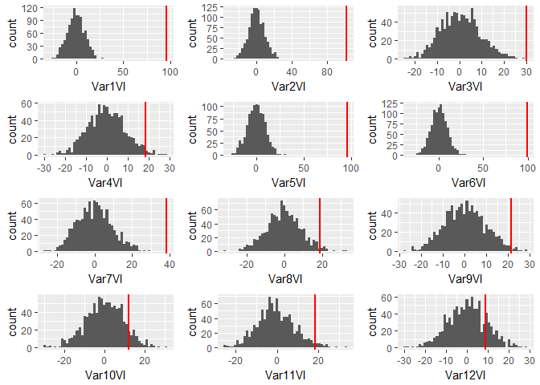

``` r
add_var_pval(siml1.wrep.results)
```

    ##                  pval.df
    ## p.val.Var.1  0.001998002
    ## p.val.Var.2  0.001998002
    ## p.val.Var.3  0.001998002
    ## p.val.Var.4  0.041958042
    ## p.val.Var.5  0.001998002
    ## p.val.Var.6  0.001998002
    ## p.val.Var.7  0.001998002
    ## p.val.Var.8  0.039960040
    ## p.val.Var.9  0.023976024
    ## p.val.Var.10 0.187812188
    ## p.val.Var.11 0.057942058
    ## p.val.Var.12 0.375624376

Above are results for the first simulated dataset with replacement. The added variable plot does seem to be useful in capturing linear relationships, even with using the random forest mechanism. In terms of variable importance scores, the original forest performs better. Part of this seems to be that even non-significant variables will be assigned a non-trivial importance scores within the forest that splits only on the difference between the full model and the model excluding the particular variable.

``` r
siml1.worep.results[[1]]
```

    ##                %IncMSE IncNodePurity
    ## added.Var1  111.048997     10971.548
    ## added.Var2  106.121386     11588.669
    ## added.Var3    2.516328      5299.535
    ## added.Var4   11.297532      5053.140
    ## added.Var5  108.347982     10729.492
    ## added.Var6  104.585429     11138.706
    ## added.Var7   16.919408      5660.936
    ## added.Var8    2.624893      5050.708
    ## added.Var9   -5.580568      5126.849
    ## added.Var10   8.062182      5073.491
    ## added.Var11   6.119376      4978.680
    ## added.Var12  -3.332849      5014.705

``` r
siml1.worep.results[[3]]
```

    ##        %IncMSE IncNodePurity
    ## V1  46.1286250     6426.0310
    ## V2  48.7899557     7323.9981
    ## V3   6.9995302     1017.1466
    ## V4   0.4535294      722.1677
    ## V5  44.5950698     6058.8743
    ## V6  45.3370838     6601.7022
    ## V7   8.0524087     1251.0652
    ## V8   1.5836117      618.4833
    ## V9   0.2858171      615.9731
    ## V10 -0.5359512      647.8768
    ## V11 -0.2775652      574.4324
    ## V12  2.3741828      726.4247

``` r
rf_added_var_plot(siml1.worep.results)
```


``` r
rf_plot_var_imp(siml1.worep.results)
```

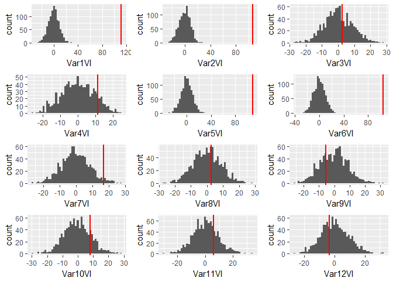

``` r
add_var_pval(siml1.worep.results)
```

    ##                  pval.df
    ## p.val.Var.1  0.001998002
    ## p.val.Var.2  0.001998002
    ## p.val.Var.3  0.751248751
    ## p.val.Var.4  0.239760240
    ## p.val.Var.5  0.001998002
    ## p.val.Var.6  0.001998002
    ## p.val.Var.7  0.069930070
    ## p.val.Var.8  0.759240759
    ## p.val.Var.9  0.595404595
    ## p.val.Var.10 0.349650350
    ## p.val.Var.11 0.481518482
    ## p.val.Var.12 0.719280719

Sampling without replacement as opposed to bootstrap withreplacement seems to improve performance of added variable then variable importance scheme. Overall, if the variables are independent, then the random forest variable importance score seems quite reliable.

``` r
siml2.wrep.results[[1]]
```

    ##                 %IncMSE IncNodePurity
    ## added.Var1   35.1859254      8869.221
    ## added.Var2   26.5403725      8908.834
    ## added.Var3    8.1920477      7959.632
    ## added.Var4   -1.4564393      7189.391
    ## added.Var5  108.6663947     16451.965
    ## added.Var6   99.8715532     15726.985
    ## added.Var7   22.7766977      8494.985
    ## added.Var8   -4.2589681      7183.866
    ## added.Var9   -0.4667828      7622.249
    ## added.Var10   3.0797485      7639.178
    ## added.Var11  13.7076961      7344.655
    ## added.Var12   1.5453554      7610.347

``` r
siml2.wrep.results[[3]]
```

    ##        %IncMSE IncNodePurity
    ## V1  20.2875375    18647.3116
    ## V2  21.2250530    22551.7447
    ## V3  16.7249325    14049.3912
    ## V4  13.8910582    10055.2400
    ## V5  46.7408279     9041.6285
    ## V6  45.8127029     7683.3450
    ## V7   8.5383769     1638.1524
    ## V8   0.8888175      727.3248
    ## V9  -1.2127735      868.0282
    ## V10 -0.3456439      877.5183
    ## V11 -0.8553306      796.3289
    ## V12 -0.9327023      832.3440

``` r
rf_added_var_plot(siml2.wrep.results)
```


``` r
rf_plot_var_imp(siml2.wrep.results)
```

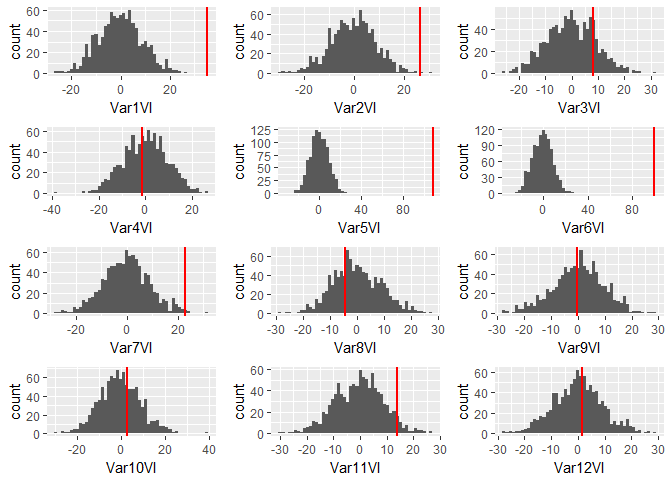

``` r
add_var_pval(siml2.wrep.results)
```

    ##                  pval.df
    ## p.val.Var.1  0.001998002
    ## p.val.Var.2  0.005994006
    ## p.val.Var.3  0.359640360
    ## p.val.Var.4  0.857142857
    ## p.val.Var.5  0.001998002
    ## p.val.Var.6  0.001998002
    ## p.val.Var.7  0.011988012
    ## p.val.Var.8  0.645354645
    ## p.val.Var.9  0.915084915
    ## p.val.Var.10 0.685314685
    ## p.val.Var.11 0.103896104
    ## p.val.Var.12 0.867132867

With correlated predictors, the added variable plots does seem to improve the performance of the variable importance somewhat. Variables 1 through 4 are correlated, so their raw variable importance score is dampened by that fact. When using added variable then variable importance scheme, variable 1 and 2 look particularly important, which we expect. The score for variable 3 increases, but the scoresfor variables 8 through 12 also increase.

``` r
siml2.worep.results[[1]]
```

    ##                %IncMSE IncNodePurity
    ## added.Var1   36.549822      4951.408
    ## added.Var2   31.512386      5031.233
    ## added.Var3    8.858480      4162.872
    ## added.Var4    3.774644      4051.229
    ## added.Var5  107.106281      9857.417
    ## added.Var6  110.572022      9627.033
    ## added.Var7   19.937063      4858.599
    ## added.Var8    8.225779      4060.818
    ## added.Var9    4.005181      4252.068
    ## added.Var10   1.235765      3786.719
    ## added.Var11  11.203266      4177.736
    ## added.Var12   1.161083      4222.423

``` r
siml2.worep.results[[3]]
```

    ##        %IncMSE IncNodePurity
    ## V1  19.0134074    11619.7786
    ## V2  20.3924577    14453.6726
    ## V3  15.9137062     8394.8009
    ## V4  14.1180494     6263.9383
    ## V5  50.0989385     5684.0861
    ## V6  45.0805474     4928.8270
    ## V7   9.7734943      963.4361
    ## V8  -0.8485379      384.7286
    ## V9   0.6959704      493.5830
    ## V10 -2.3949269      467.2598
    ## V11 -1.1344581      423.9907
    ## V12 -0.1634891      415.8071

``` r
rf_added_var_plot(siml2.worep.results)
```


``` r
rf_plot_var_imp(siml2.worep.results)
```

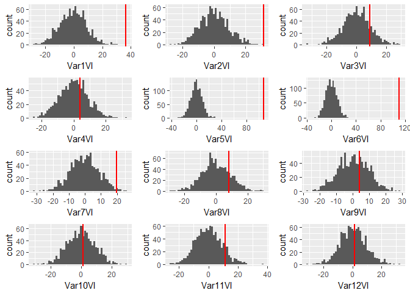

``` r
add_var_pval(siml2.worep.results)
```

    ##                  pval.df
    ## p.val.Var.1  0.001998002
    ## p.val.Var.2  0.001998002
    ## p.val.Var.3  0.329670330
    ## p.val.Var.4  0.675324675
    ## p.val.Var.5  0.001998002
    ## p.val.Var.6  0.001998002
    ## p.val.Var.7  0.025974026
    ## p.val.Var.8  0.371628372
    ## p.val.Var.9  0.733266733
    ## p.val.Var.10 0.881118881
    ## p.val.Var.11 0.237762238
    ## p.val.Var.12 0.915084915

Sampling without replacement improves the performance of the added variable then variable importance scheme, although the issue of irrelvant variables (particularly variables 8 through 12) persists.

``` r
#independent variables with a non-linear response
#n3 is number of observations
n3 <- n
#p3 is numberof variables
p3 <- p
#some error to add in 
err3 <- rnorm(n3, mean = 0, sd = 0.05)
siml.data3 <- as.data.frame(matrix(rnorm(n3*p3, mean = 0, sd = 1), nrow = n3))
siml.data3 <- siml.data3 %>% 
  mutate(Y = 5*V1^4+5*V2^3+6*V3^4+5*V5^3+err3)

#correlated variables with a non-linear response
n4 <- 500
err4 <- rnorm(n4, mean = 0, sd = 0.05)
siml.data4 <- as.data.frame(rmvnorm(n = n4, mean = rep(0, times = 12), sigma = Sigma2))
siml.data4 <- siml.data4 %>%
  mutate(Y = 5*V1^4+5*V2^3+6*V3^4+5*V5^3+err4)

siml3.wrep.results <- perm_add_var_randomforest(data = siml.data3, it = it.sim, ntree1 = ntree.sim1, 
                                                ntree2 = ntree.sim2, ntree3 = ntree.sim3)
siml3.worep.results <- perm_add_var_randomforest(data = siml.data3, it = it.sim, ntree1 = ntree.sim1, 
                                                 ntree2 = ntree.sim2, ntree3 = ntree.sim3, replace = FALSE)
siml4.wrep.results <- perm_add_var_randomforest(data = siml.data4, it = it.sim, ntree1 = ntree.sim1, 
                                                ntree2 = ntree.sim2, ntree3 = ntree.sim3)
siml4.worep.results <- perm_add_var_randomforest(data = siml.data4, it = it.sim, ntree1 = ntree.sim1, 
                                                 ntree2 = ntree.sim2, ntree3 = ntree.sim3, replace = FALSE)
```

``` r
#Simulation of non-linear response with iid variables and bootstrap resampling 
#with replacement

siml3.wrep.results[[1]]
```

    ##               %IncMSE IncNodePurity
    ## added.Var1  70.333093       2226283
    ## added.Var2  34.153602       1289354
    ## added.Var3  48.033996       2735957
    ## added.Var4  25.799354       1152025
    ## added.Var5  28.289591       1192229
    ## added.Var6  26.778778       1176711
    ## added.Var7  31.063037       1229830
    ## added.Var8  18.774802       1144286
    ## added.Var9  23.605721       1191309
    ## added.Var10 13.005516       1209734
    ## added.Var11  8.038496       1010935
    ## added.Var12 30.578141       1177266

``` r
siml3.wrep.results[[3]]
```

    ##          %IncMSE IncNodePurity
    ## V1  34.350353330     898333.62
    ## V2   4.638147728     175024.98
    ## V3  32.213318669    1315828.44
    ## V4  -0.216376691      67327.58
    ## V5  -0.186911855     345241.55
    ## V6  -1.383459686      73530.95
    ## V7   0.582701580      77910.91
    ## V8   0.005031345      84038.63
    ## V9  -1.200479413      49105.18
    ## V10  0.510597612      72625.82
    ## V11 -2.269505830      40545.14
    ## V12  2.291879013      86354.68

``` r
rf_added_var_plot(siml3.wrep.results)
```


``` r
rf_plot_var_imp(siml3.wrep.results)
```

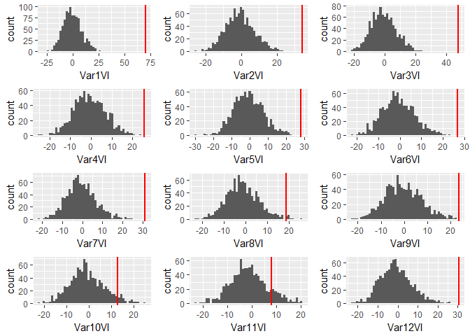

``` r
add_var_pval(siml3.wrep.results)
```

    ##                  pval.df
    ## p.val.Var.1  0.001998002
    ## p.val.Var.2  0.001998002
    ## p.val.Var.3  0.001998002
    ## p.val.Var.4  0.001998002
    ## p.val.Var.5  0.001998002
    ## p.val.Var.6  0.001998002
    ## p.val.Var.7  0.001998002
    ## p.val.Var.8  0.025974026
    ## p.val.Var.9  0.001998002
    ## p.val.Var.10 0.101898102
    ## p.val.Var.11 0.241758242
    ## p.val.Var.12 0.001998002

Appears to be in this scenario, that full random forest offers better interpretation of important variables than added variable importance scheme. This is likely due to variability introduced by bootstrap resampling with replacement,

``` r
#Simulation of non-linear response with iid variables and 
#bootstrap resampling without replacement
siml3.worep.results[[1]]
```

    ##               %IncMSE IncNodePurity
    ## added.Var1  70.393112     1227320.5
    ## added.Var2  18.898000      701146.9
    ## added.Var3  52.450616     1694658.7
    ## added.Var4  36.343795      732938.9
    ## added.Var5  25.067514      530629.1
    ## added.Var6  16.591708      728172.4
    ## added.Var7  19.252614      627985.2
    ## added.Var8  27.415385      716074.4
    ## added.Var9   2.383145      647091.5
    ## added.Var10 17.954258      630165.1
    ## added.Var11 14.907463      706048.9
    ## added.Var12 23.763107      649730.6

``` r
siml3.worep.results[[3]]
```

    ##         %IncMSE IncNodePurity
    ## V1  34.09879979     543308.30
    ## V2   6.43143592      92312.93
    ## V3  34.68556176     850787.37
    ## V4  -0.88970053      39668.43
    ## V5  -0.25149803     183285.64
    ## V6  -1.24667725      31017.40
    ## V7  -1.16396427      34517.61
    ## V8  -0.04496339      31610.56
    ## V9   0.95262777      16543.46
    ## V10 -0.16952797      33618.00
    ## V11 -1.74545271      16822.71
    ## V12  1.95429703      41072.99

``` r
rf_added_var_plot(siml3.worep.results)
```


``` r
rf_plot_var_imp(siml3.worep.results)
```

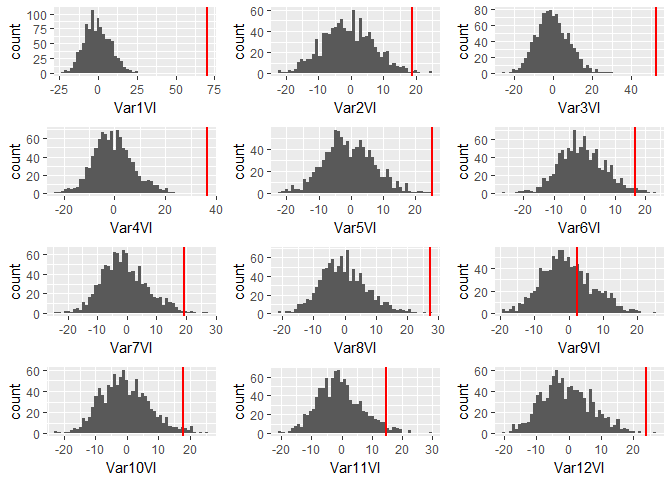

``` r
add_var_pval(siml3.worep.results)
```

    ##                  pval.df
    ## p.val.Var.1  0.001998002
    ## p.val.Var.2  0.017982018
    ## p.val.Var.3  0.001998002
    ## p.val.Var.4  0.001998002
    ## p.val.Var.5  0.001998002
    ## p.val.Var.6  0.037962038
    ## p.val.Var.7  0.017982018
    ## p.val.Var.8  0.003996004
    ## p.val.Var.9  0.657342657
    ## p.val.Var.10 0.041958042
    ## p.val.Var.11 0.053946054
    ## p.val.Var.12 0.003996004

In this scenario, appears that added variable importance and the full random forest offer similar interpretations of which the influential variables are. In particular, we see that variables 1, 2, 3, and 5 are all assigned high variable importance scores as expected.

``` r
#simulation with non-linear response and correlated predictors
#using bootstrap resampling with replacement
siml4.wrep.results[[1]]
```

    ##               %IncMSE IncNodePurity
    ## added.Var1  41.105673     1287899.4
    ## added.Var2  18.508842     1058858.4
    ## added.Var3  45.216181     1185600.8
    ## added.Var4  12.047308     1065630.0
    ## added.Var5  30.486230     1141792.8
    ## added.Var6  19.695591      990795.8
    ## added.Var7   7.628575      834938.9
    ## added.Var8  17.140621     1033941.4
    ## added.Var9   5.975371      985320.5
    ## added.Var10  8.273642     1060979.3
    ## added.Var11  8.354458      974986.4
    ## added.Var12 12.141100      911176.9

``` r
siml4.wrep.results[[3]]
```

    ##         %IncMSE IncNodePurity
    ## V1  18.44688417    1120353.42
    ## V2  12.37642200     822162.10
    ## V3  17.63246010    1076563.24
    ## V4  11.28806214     680521.83
    ## V5  13.79328932     122837.08
    ## V6   1.81082877      31225.81
    ## V7  -0.07131189      38251.00
    ## V8  -1.73081746      20551.36
    ## V9  -0.24040678      18151.66
    ## V10 -1.06480248      32870.86
    ## V11 -1.63341829      32856.07
    ## V12  1.22977157      27806.80

``` r
rf_added_var_plot(siml4.wrep.results)
```


``` r
rf_plot_var_imp(siml4.wrep.results)
```

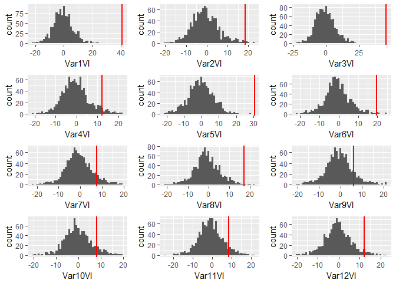

``` r
add_var_pval(siml4.wrep.results)
```

    ##                  pval.df
    ## p.val.Var.1  0.001998002
    ## p.val.Var.2  0.017982018
    ## p.val.Var.3  0.001998002
    ## p.val.Var.4  0.095904096
    ## p.val.Var.5  0.001998002
    ## p.val.Var.6  0.017982018
    ## p.val.Var.7  0.199800200
    ## p.val.Var.8  0.011988012
    ## p.val.Var.9  0.267732268
    ## p.val.Var.10 0.203796204
    ## p.val.Var.11 0.173826174
    ## p.val.Var.12 0.089910090

With correlated predictors and non-linear response, the full random forest variable importance has trouble determining which variables are important, in particular, variable 4 appears to be more important than it actually is. The added variable importance is able to separate out the importance of variables 1, 3, and 5, but has difficulties with determining variable 2 is important. Examining the added variable plots, we see that the added variable plot for variable 2 has a similar shape to the added variable plot for variable 4.

``` r
#simulation with non-linear response and correlated predictors
#using bootstrap resampling without replacement
siml4.worep.results[[1]]
```

    ##               %IncMSE IncNodePurity
    ## added.Var1  36.978416      627027.4
    ## added.Var2  23.306383      508104.5
    ## added.Var3  46.309016      746476.0
    ## added.Var4  11.349148      706306.3
    ## added.Var5  31.054388      477041.3
    ## added.Var6  21.592758      572840.1
    ## added.Var7  18.788626      451893.8
    ## added.Var8  12.250614      585352.3
    ## added.Var9  23.676031      502163.8
    ## added.Var10 11.434514      413627.2
    ## added.Var11 -1.262669      522173.1
    ## added.Var12  3.871764      614452.9

``` r
siml4.worep.results[[3]]
```

    ##        %IncMSE IncNodePurity
    ## V1  16.2368311    685414.955
    ## V2  12.3347698    554842.253
    ## V3  17.9869971    605377.828
    ## V4  12.4147946    466898.908
    ## V5  13.2032814     78874.847
    ## V6   0.3647423     15993.133
    ## V7  -1.3620933     10151.242
    ## V8   0.6202516      7951.579
    ## V9   0.3249437      9067.183
    ## V10 -0.9916761      7557.807
    ## V11  0.9036519     22145.201
    ## V12  2.6428029     13127.410

``` r
rf_added_var_plot(siml4.worep.results)
```

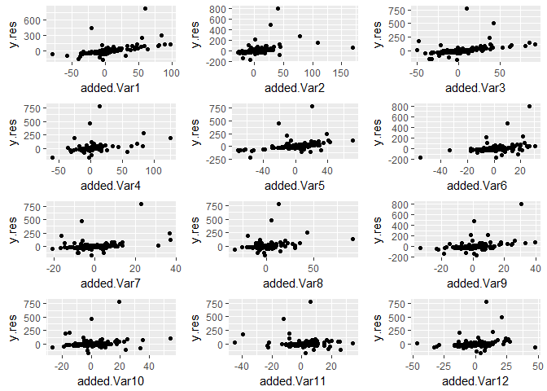

``` r
rf_plot_var_imp(siml4.worep.results)
```

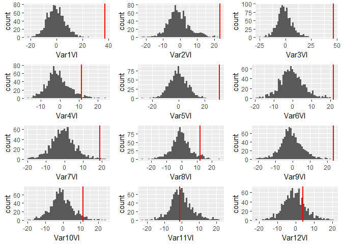

``` r
add_var_pval(siml4.worep.results)
```

    ##                  pval.df
    ## p.val.Var.1  0.001998002
    ## p.val.Var.2  0.001998002
    ## p.val.Var.3  0.001998002
    ## p.val.Var.4  0.067932068
    ## p.val.Var.5  0.001998002
    ## p.val.Var.6  0.001998002
    ## p.val.Var.7  0.011988012
    ## p.val.Var.8  0.085914086
    ## p.val.Var.9  0.001998002
    ## p.val.Var.10 0.079920080
    ## p.val.Var.11 0.917082917
    ## p.val.Var.12 0.407592408

``` r
#Interactions 

#iid dataset for interactions 
n5 <- n
p5 <- p
err5 <- rnorm(n5, mean = 0, sd = 0.05)
siml.data5 <- as.data.frame(matrix(rnorm(n5*p5, mean = 0, sd = 1), nrow = n5))
siml.data5 <- siml.data5 %>%
  mutate(Y = 8*V1*V2+7*V5*V6+err5)


#Correlated variables for interactions 
n6 <- n
err6 <- rnorm(n6, mean = 0 , sd = 0.05)
siml.data6 <- as.data.frame(rmvnorm(n = n6, mean = rep(0, times = 12), sigma = Sigma2))
siml.data6 <- siml.data6 %>%
  mutate(Y = 8*V1*V2+7*V5*V6+err6)

siml5.wrep.results <- perm_add_var_randomforest(data = siml.data5, it = it.sim, ntree1 = ntree.sim1, 
                                                ntree2 = ntree.sim2, ntree3 = ntree.sim3)
siml5.worep.results <- perm_add_var_randomforest(data = siml.data5, it = it.sim, ntree1 = ntree.sim1, 
                                                 ntree2 = ntree.sim2, ntree3 = ntree.sim3, replace = FALSE)
siml6.wrep.results <- perm_add_var_randomforest(data = siml.data6, it = it.sim, ntree1 = ntree.sim1, 
                                                ntree2 = ntree.sim2, ntree3 = ntree.sim3)
siml6.worep.results <- perm_add_var_randomforest(data = siml.data6, it = it.sim, ntree1 = ntree.sim1, 
                                                 ntree2 = ntree.sim2, ntree3 = ntree.sim3, replace = FALSE)
```

``` r
#simulation of interactions with iid predictors
#and bootstrap resampling with replacement
siml5.wrep.results[[1]]
```

    ##               %IncMSE IncNodePurity
    ## added.Var1  34.397287      44617.82
    ## added.Var2  56.041442      45161.72
    ## added.Var3  11.422326      36040.06
    ## added.Var4  -1.664009      34340.43
    ## added.Var5  52.099556      45301.49
    ## added.Var6  54.409199      46661.03
    ## added.Var7  17.550815      35824.30
    ## added.Var8  16.230436      37752.03
    ## added.Var9   6.916834      35710.21
    ## added.Var10 -4.010117      36377.73
    ## added.Var11  2.584493      34810.72
    ## added.Var12 20.778742      36133.20

``` r
siml5.wrep.results[[3]]
```

    ##         %IncMSE IncNodePurity
    ## V1  15.93934884     10146.186
    ## V2  19.25774868     12340.321
    ## V3  -1.29319796      2438.203
    ## V4   2.03487038      2105.878
    ## V5  14.25722092      7337.861
    ## V6  14.94773022      6275.406
    ## V7  -0.71244593      2383.148
    ## V8   0.07992647      2232.493
    ## V9  -0.40226697      2364.315
    ## V10  0.95177657      2398.926
    ## V11 -0.04169402      2174.975
    ## V12  1.71722959      2906.813

``` r
rf_added_var_plot(siml5.wrep.results)
```


``` r
rf_plot_var_imp(siml5.wrep.results)
```

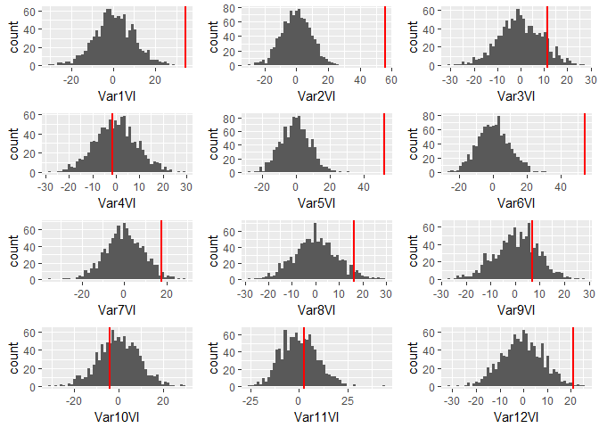

``` r
add_var_pval(siml5.wrep.results)
```

    ##                  pval.df
    ## p.val.Var.1  0.001998002
    ## p.val.Var.2  0.001998002
    ## p.val.Var.3  0.205794206
    ## p.val.Var.4  0.869130869
    ## p.val.Var.5  0.001998002
    ## p.val.Var.6  0.001998002
    ## p.val.Var.7  0.047952048
    ## p.val.Var.8  0.089910090
    ## p.val.Var.9  0.469530470
    ## p.val.Var.10 0.661338661
    ## p.val.Var.11 0.809190809
    ## p.val.Var.12 0.017982018

``` r
#simulation of interactions with iid predictors
#and bootstrap resampling without replacement
siml5.worep.results[[1]]
```

    ##                %IncMSE IncNodePurity
    ## added.Var1  26.2606436      24477.54
    ## added.Var2  43.3570313      25487.50
    ## added.Var3  10.3943277      19426.33
    ## added.Var4  -3.7718555      19396.07
    ## added.Var5  58.6637059      26329.36
    ## added.Var6  66.8045081      26815.86
    ## added.Var7   1.7819165      18108.42
    ## added.Var8   1.8202348      19765.29
    ## added.Var9  11.4127849      20481.47
    ## added.Var10 11.3806423      19520.08
    ## added.Var11  9.8262583      20011.98
    ## added.Var12  0.9570451      18948.29

``` r
siml5.worep.results[[3]]
```

    ##        %IncMSE IncNodePurity
    ## V1  13.4716653      6383.703
    ## V2  17.1619154      7726.898
    ## V3   0.8745048      1208.019
    ## V4  -1.6603998      1083.704
    ## V5  13.6847925      4605.127
    ## V6  15.8183644      4012.949
    ## V7  -0.2792604      1293.011
    ## V8  -1.4278918      1216.411
    ## V9   0.9693695      1301.719
    ## V10  0.5093097      1119.965
    ## V11 -0.7822999      1091.468
    ## V12  2.0140367      1550.817

``` r
rf_added_var_plot(siml5.worep.results)
```


``` r
rf_plot_var_imp(siml5.worep.results)
```

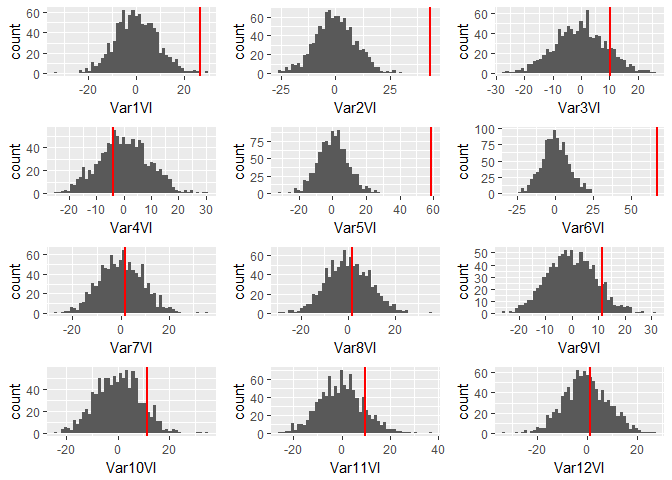

``` r
add_var_pval(siml5.worep.results)
```

    ##                  pval.df
    ## p.val.Var.1  0.005994006
    ## p.val.Var.2  0.001998002
    ## p.val.Var.3  0.257742258
    ## p.val.Var.4  0.695304695
    ## p.val.Var.5  0.001998002
    ## p.val.Var.6  0.001998002
    ## p.val.Var.7  0.833166833
    ## p.val.Var.8  0.837162837
    ## p.val.Var.9  0.219780220
    ## p.val.Var.10 0.199800200
    ## p.val.Var.11 0.265734266
    ## p.val.Var.12 0.831168831

For interactions with iid predictors, the full random forest variable importance and added variable importance perform similarly in terms of determining which variables are important. Bootstrap resampling without replacement does not seem to offer performance benefits in this particular scenario.

``` r
#simulation of interactions with correlated predictors
#and bootstrap resampling with replacement
siml6.wrep.results[[1]]
```

    ##                %IncMSE IncNodePurity
    ## added.Var1  26.3267987      25124.60
    ## added.Var2  14.1426915      22273.77
    ## added.Var3   4.0934589      20434.75
    ## added.Var4   5.4864207      19332.47
    ## added.Var5  22.5263284      22814.20
    ## added.Var6  17.1308008      23391.35
    ## added.Var7  -7.2052842      20776.80
    ## added.Var8  -0.2950692      21090.07
    ## added.Var9  -1.5845183      20087.11
    ## added.Var10 -0.8563902      20671.27
    ## added.Var11 -0.9190469      20214.33
    ## added.Var12  5.6560029      20117.51

``` r
siml6.wrep.results[[3]]
```

    ##        %IncMSE IncNodePurity
    ## V1  25.4682450     21815.319
    ## V2  21.3563606     15689.259
    ## V3  15.7079344     10534.551
    ## V4  12.2549810      7879.147
    ## V5   6.9315722      4572.419
    ## V6   8.4503669      3795.474
    ## V7  -0.4144278      1582.789
    ## V8  -0.4187158      1221.496
    ## V9  -1.4193500      1458.051
    ## V10  0.4010058      1321.373
    ## V11  1.0137502      1350.905
    ## V12  1.3301566      1568.094

``` r
rf_added_var_plot(siml6.wrep.results)
```


``` r
rf_plot_var_imp(siml6.wrep.results)
```

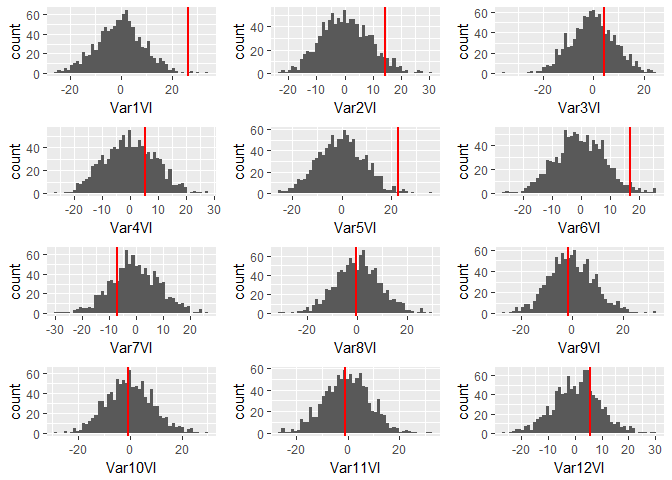

``` r
add_var_pval(siml6.wrep.results)
```

    ##                 pval.df
    ## p.val.Var.1  0.01198801
    ## p.val.Var.2  0.12187812
    ## p.val.Var.3  0.59940060
    ## p.val.Var.4  0.55744256
    ## p.val.Var.5  0.02197802
    ## p.val.Var.6  0.05794206
    ## p.val.Var.7  0.44355644
    ## p.val.Var.8  0.94505495
    ## p.val.Var.9  0.88911089
    ## p.val.Var.10 0.94905095
    ## p.val.Var.11 0.95104895
    ## p.val.Var.12 0.54545455

``` r
#simulation of interactions with correlated predictors
#and bootstrap resampling without replacement
siml6.worep.results[[1]]
```

    ##                %IncMSE IncNodePurity
    ## added.Var1  33.1722931      14280.93
    ## added.Var2  -1.1897713      11360.82
    ## added.Var3  13.5592355      12020.85
    ## added.Var4  -3.5022853      10957.28
    ## added.Var5  19.4799751      12208.71
    ## added.Var6  18.5745636      13242.57
    ## added.Var7   0.7917057      11223.94
    ## added.Var8   4.7527655      11310.76
    ## added.Var9   5.6892485      11305.75
    ## added.Var10  4.3669985      10853.80
    ## added.Var11 -1.4313504      11132.05
    ## added.Var12  1.6729289      10865.36

``` r
siml6.worep.results[[3]]
```

    ##         %IncMSE IncNodePurity
    ## V1  27.38601873    12996.7123
    ## V2  22.41007735     9838.3182
    ## V3  16.49015620     6219.7377
    ## V4  12.76697843     5514.2353
    ## V5   7.42327802     2941.9157
    ## V6   7.59364348     2534.9661
    ## V7  -0.07377331      899.9226
    ## V8  -1.72234517      649.1451
    ## V9  -2.18389444      843.5372
    ## V10  0.19636674      665.0539
    ## V11  0.17876643      689.9707
    ## V12  0.96958415      838.3373

``` r
rf_added_var_plot(siml6.worep.results)
```

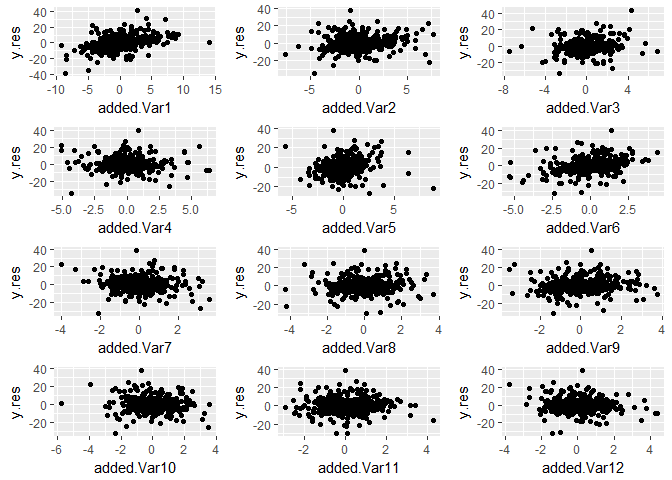

``` r
rf_plot_var_imp(siml6.worep.results)
```

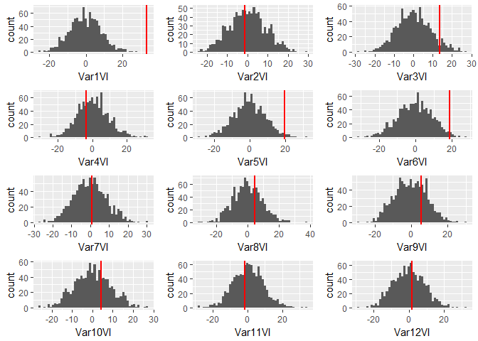

``` r
add_var_pval(siml6.worep.results)
```

    ##                  pval.df
    ## p.val.Var.1  0.001998002
    ## p.val.Var.2  0.901098901
    ## p.val.Var.3  0.155844156
    ## p.val.Var.4  0.693306693
    ## p.val.Var.5  0.033966034
    ## p.val.Var.6  0.033966034
    ## p.val.Var.7  0.901098901
    ## p.val.Var.8  0.607392607
    ## p.val.Var.9  0.533466533
    ## p.val.Var.10 0.639360639
    ## p.val.Var.11 0.813186813
    ## p.val.Var.12 0.833166833

With interacting terms using correlated predictors, the random forest seems to overinflate of the irrelevant predictors that are correlated with variables 1 and 2 (which are actually important). In this regard, the added variable importance correctly deflates the importance of the irrelevant correlated predictors. Sampling with and without replacement seem to offer similar performance in this scenario.

``` r
#independent non-linear Predictors
n7 <- n
p7 <- p
err7 <- rnorm(n7, mean = 0, sd = 0.05)
siml.data7 <- as.data.frame(matrix(rnorm(n7*p7, mean = 0, sd = 1), nrow = n7))
siml.data7 <- siml.data7 %>%
  mutate(Y = 3^V1+2^V2+4^V5+err7)


#Correlated variables for strongly non-linear predictors 
n8 <- n
err8 <- rnorm(n8, mean = 0 , sd = 0.05)
siml.data8 <- as.data.frame(rmvnorm(n = n8, mean = rep(0, times = 12), sigma = Sigma2))
siml.data8 <- siml.data8 %>%
  mutate(Y = 3^V1+2^V2+4^V5+err8)
```

``` r
siml7.wrep.results <- perm_add_var_randomforest(data = siml.data7, it = it.sim, ntree1 = ntree.sim1, 
                                                ntree2 = ntree.sim2, ntree3 = ntree.sim3)
siml7.worep.results <- perm_add_var_randomforest(data = siml.data7, it = it.sim, ntree1 = ntree.sim1, 
                                                 ntree2 = ntree.sim2, ntree3 = ntree.sim3, replace = FALSE)
siml8.wrep.results <- perm_add_var_randomforest(data = siml.data8, it = it.sim, ntree1 = ntree.sim1, 
                                                ntree2 = ntree.sim2, ntree3 = ntree.sim3)
siml8.worep.results <- perm_add_var_randomforest(data = siml.data8, it = it.sim, ntree1 = ntree.sim1, 
                                                 ntree2 = ntree.sim2, ntree3 = ntree.sim3, replace = FALSE)
```

``` r
#independent strongly non-linear predictors
#with sampling with replacement
siml7.wrep.results[[1]]
```

    ##              %IncMSE IncNodePurity
    ## added.Var1  53.73492     10391.843
    ## added.Var2  32.33921      7863.230
    ## added.Var3  10.09951      8327.991
    ## added.Var4   5.49355      8139.958
    ## added.Var5  37.90868     17028.310
    ## added.Var6  24.81810      7498.969
    ## added.Var7  13.66741      8074.773
    ## added.Var8  17.96494      7537.932
    ## added.Var9  11.24837      9037.236
    ## added.Var10 18.94536      9308.437
    ## added.Var11 21.18968      7192.670
    ## added.Var12 21.11972      8869.688

``` r
siml7.wrep.results[[3]]
```

    ##        %IncMSE IncNodePurity
    ## V1  17.5907311     2440.9985
    ## V2   2.4908685     1464.0258
    ## V3   0.6134975      345.9741
    ## V4  -0.7869933      193.5964
    ## V5  29.0209081    10934.7961
    ## V6  -0.9892670      157.1338
    ## V7   2.5910179      827.4648
    ## V8   0.7785389      156.1894
    ## V9  -1.2282254      280.0926
    ## V10  0.5686352      843.0324
    ## V11  1.6161926      580.3493
    ## V12 -0.4982208      293.6839

``` r
rf_added_var_plot(siml7.wrep.results)
```

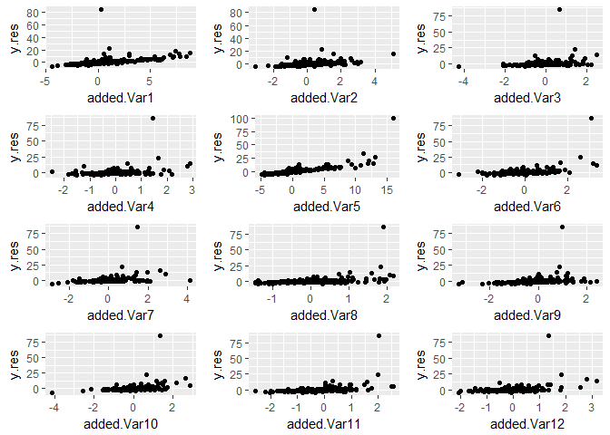

``` r
rf_plot_var_imp(siml7.wrep.results)
```

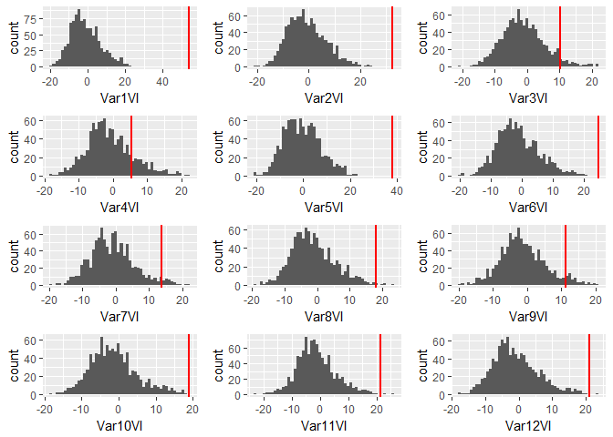

``` r
add_var_pval(siml7.wrep.results)
```

    ##                  pval.df
    ## p.val.Var.1  0.001998002
    ## p.val.Var.2  0.001998002
    ## p.val.Var.3  0.103896104
    ## p.val.Var.4  0.329670330
    ## p.val.Var.5  0.001998002
    ## p.val.Var.6  0.001998002
    ## p.val.Var.7  0.063936064
    ## p.val.Var.8  0.013986014
    ## p.val.Var.9  0.111888112
    ## p.val.Var.10 0.001998002
    ## p.val.Var.11 0.005994006
    ## p.val.Var.12 0.003996004

``` r
#independent strongly non-linear predictors 
#with sampling without replacement
siml7.worep.results[[1]]
```

    ##              %IncMSE IncNodePurity
    ## added.Var1  48.74295      6265.394
    ## added.Var2  26.97902      4497.190
    ## added.Var3  22.62281      4288.852
    ## added.Var4  15.05329      5518.069
    ## added.Var5  39.89312     10365.548
    ## added.Var6  18.82992      3722.755
    ## added.Var7  18.41912      4040.654
    ## added.Var8  20.99503      3107.592
    ## added.Var9  19.80038      3174.053
    ## added.Var10 21.48988      3219.508
    ## added.Var11 26.65927      3125.337
    ## added.Var12 22.94547      3355.659

``` r
siml7.worep.results[[3]]
```

    ##         %IncMSE IncNodePurity
    ## V1  17.62534813    1491.57972
    ## V2   3.27810947     850.93436
    ## V3   0.78253690     104.18255
    ## V4   0.09515481     111.69396
    ## V5  26.25179509    6720.12141
    ## V6   1.02591886     118.61800
    ## V7   1.71350186     580.68018
    ## V8  -0.09019460     128.14617
    ## V9   0.23667238      90.07826
    ## V10  0.81023083     328.03178
    ## V11  1.43135685     218.62713
    ## V12 -0.55037589     174.27076

``` r
rf_added_var_plot(siml7.worep.results)
```

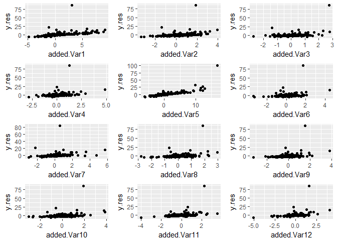

``` r
rf_plot_var_imp(siml7.worep.results)
```

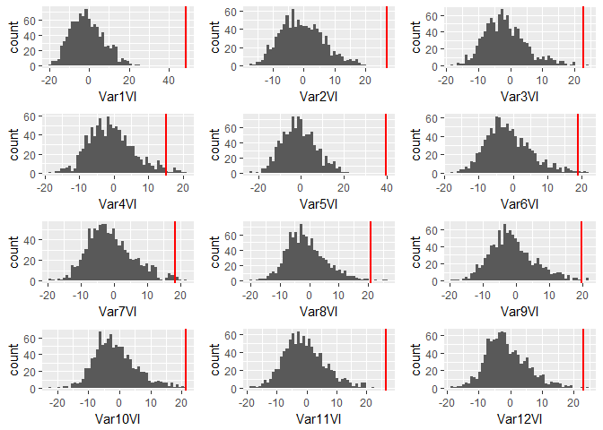

``` r
add_var_pval(siml7.worep.results)
```

    ##                  pval.df
    ## p.val.Var.1  0.001998002
    ## p.val.Var.2  0.001998002
    ## p.val.Var.3  0.003996004
    ## p.val.Var.4  0.035964036
    ## p.val.Var.5  0.001998002
    ## p.val.Var.6  0.013986014
    ## p.val.Var.7  0.015984016
    ## p.val.Var.8  0.007992008
    ## p.val.Var.9  0.007992008
    ## p.val.Var.10 0.001998002
    ## p.val.Var.11 0.001998002
    ## p.val.Var.12 0.003996004

``` r
#correlated strongly non-linear predictors 
#with sampling with replacement
siml8.wrep.results[[1]]
```

    ##              %IncMSE IncNodePurity
    ## added.Var1  54.76368      1553.838
    ## added.Var2  31.05420      1234.624
    ## added.Var3  35.88668      1305.651
    ## added.Var4  24.74356      1016.687
    ## added.Var5  77.24809      7181.455
    ## added.Var6  28.90822      1220.610
    ## added.Var7  12.01192      1025.597
    ## added.Var8  36.88289      1086.577
    ## added.Var9  33.82914      1151.392
    ## added.Var10 35.23420      1116.361
    ## added.Var11 26.19698      1123.115
    ## added.Var12 30.50403      1133.244

``` r
siml8.wrep.results[[3]]
```

    ##         %IncMSE IncNodePurity
    ## V1  12.39882948     1804.7443
    ## V2  11.02576119     1208.2379
    ## V3   7.74573896     1133.1138
    ## V4   8.47040408      733.7700
    ## V5  52.16835296     4894.1435
    ## V6  -1.19605639      114.0830
    ## V7  -2.02827008      157.7059
    ## V8  -0.26180305      128.4666
    ## V9  -0.00464419      196.3159
    ## V10 -0.37606367      141.9715
    ## V11  2.47607477      131.3603
    ## V12  0.43530589      163.8605

``` r
rf_added_var_plot(siml8.wrep.results)
```

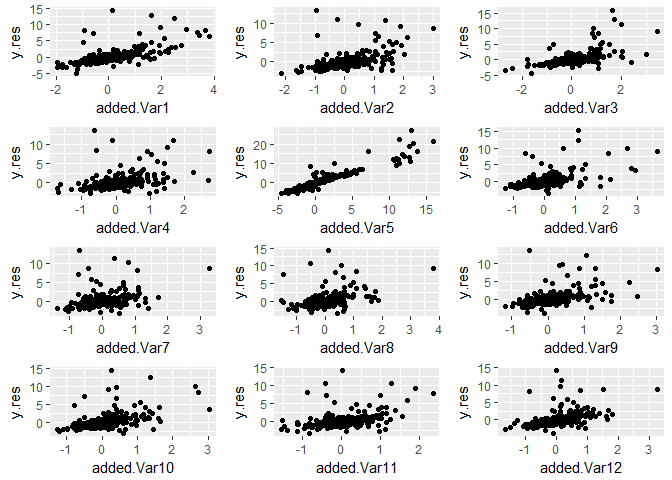

``` r
rf_plot_var_imp(siml8.wrep.results)
```

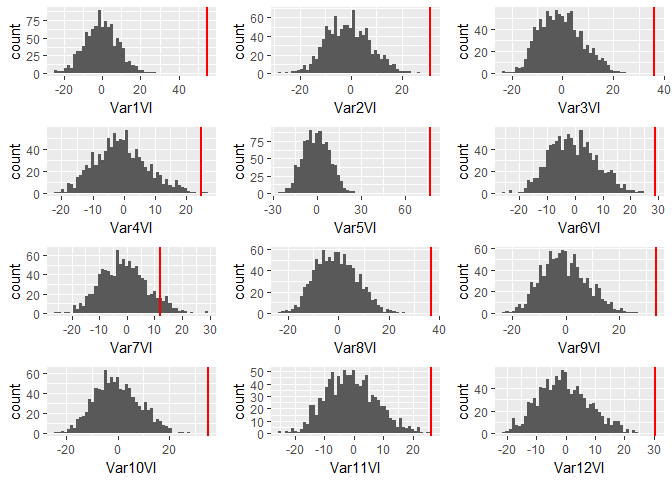

``` r
add_var_pval(siml8.wrep.results)
```

    ##                  pval.df
    ## p.val.Var.1  0.001998002
    ## p.val.Var.2  0.001998002
    ## p.val.Var.3  0.001998002
    ## p.val.Var.4  0.005994006
    ## p.val.Var.5  0.001998002
    ## p.val.Var.6  0.001998002
    ## p.val.Var.7  0.147852148
    ## p.val.Var.8  0.001998002
    ## p.val.Var.9  0.001998002
    ## p.val.Var.10 0.001998002
    ## p.val.Var.11 0.001998002
    ## p.val.Var.12 0.001998002

``` r
#correlated strongly non-linear predictors
#with sampling without replacement
siml8.worep.results[[1]]
```

    ##              %IncMSE IncNodePurity
    ## added.Var1  49.97943      784.3882
    ## added.Var2  22.44662      648.5622
    ## added.Var3  39.72164      732.2787
    ## added.Var4  32.97977      610.5498
    ## added.Var5  78.46129     4563.1385
    ## added.Var6  19.06747      577.6152
    ## added.Var7  21.08669      590.8640
    ## added.Var8  34.53890      688.4835
    ## added.Var9  25.92038      620.2086
    ## added.Var10 32.64854      644.1319
    ## added.Var11 39.08916      699.8160
    ## added.Var12 11.15026      549.4133

``` r
siml8.worep.results[[1]]
```

    ##              %IncMSE IncNodePurity
    ## added.Var1  49.97943      784.3882
    ## added.Var2  22.44662      648.5622
    ## added.Var3  39.72164      732.2787
    ## added.Var4  32.97977      610.5498
    ## added.Var5  78.46129     4563.1385
    ## added.Var6  19.06747      577.6152
    ## added.Var7  21.08669      590.8640
    ## added.Var8  34.53890      688.4835
    ## added.Var9  25.92038      620.2086
    ## added.Var10 32.64854      644.1319
    ## added.Var11 39.08916      699.8160
    ## added.Var12 11.15026      549.4133

``` r
rf_added_var_plot(siml8.worep.results)
```

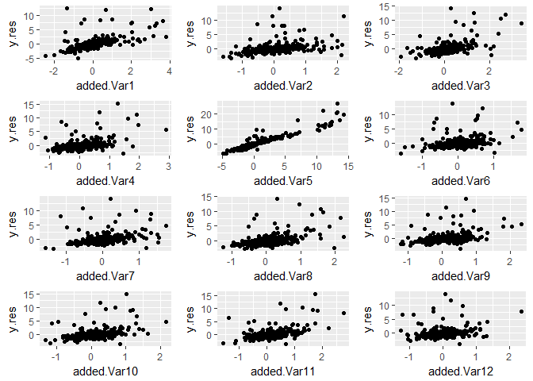

``` r
rf_plot_var_imp(siml8.worep.results)
```

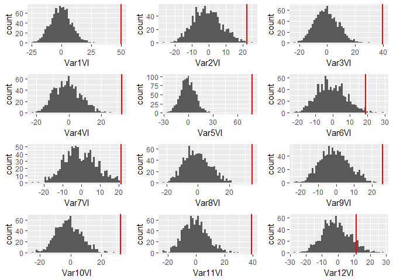

``` r
add_var_pval(siml8.worep.results)
```

    ##                  pval.df
    ## p.val.Var.1  0.001998002
    ## p.val.Var.2  0.003996004
    ## p.val.Var.3  0.001998002
    ## p.val.Var.4  0.001998002
    ## p.val.Var.5  0.001998002
    ## p.val.Var.6  0.019980020
    ## p.val.Var.7  0.001998002
    ## p.val.Var.8  0.001998002
    ## p.val.Var.9  0.003996004
    ## p.val.Var.10 0.001998002
    ## p.val.Var.11 0.001998002
    ## p.val.Var.12 0.177822178
