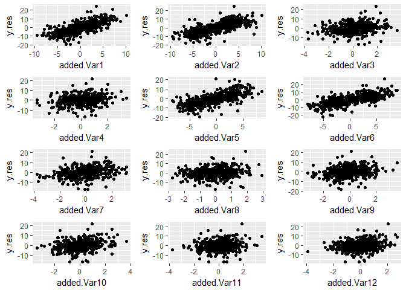
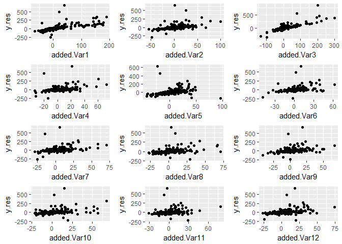
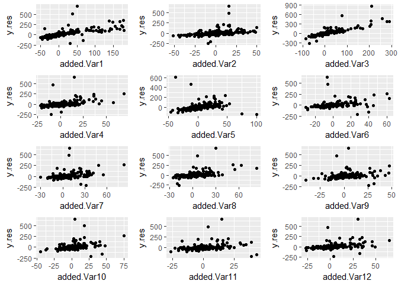
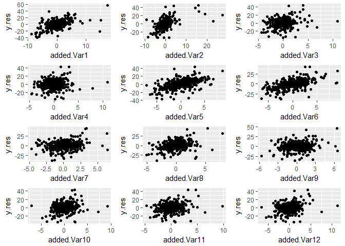
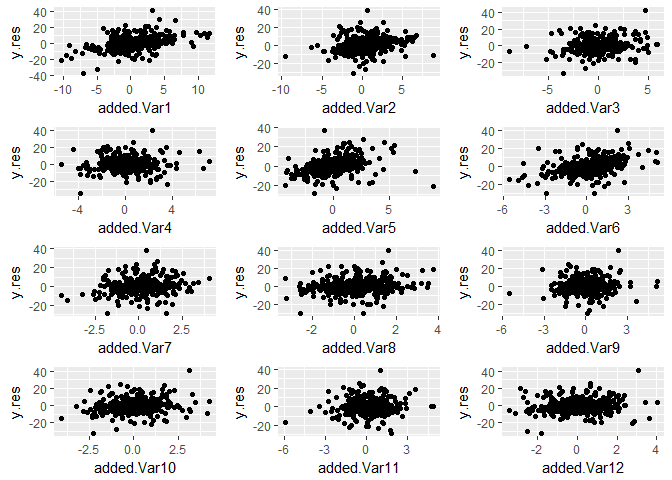

Simulation for Added Variable Plot then Variable Importance Scheme
================
Emerson Webb
3/14/2018

Next want to write a function which takes a dataframe and applys the added-variable plot then permute scheme to each predictor in the dataset.

``` r
#first need to take our data frame and make the p+1 datasets that we apply the random forest to

#itr_col takes as input an integer and removes that column from the dataset
#note: should make itr_col more robust
itr_col <- function(i, data){
  select(data,-i)
}

#df_combs is a function which takes as input a dataframe and returns all iterations of the
#dataframe where one predictor has been removed. Output is a p+1 element list where each element
#is a dataframe with the ith variable removed. the last element of the list is the entire dataframe
df_combs <- function(data){
  p <- ncol(data)-1
  df.list <- map(1:p, itr_col, data = data)
  df.list[[p+1]] <- data
  df.list
}

#extract_rf_pred is a function which takes as input 
#a list of randomforest objects, an index value, 
#and the number of predictors in the model and 
#outputs the predicted values of the random forest in 
#a dataframe. extract_rf_pred is mainly for use in map_dfc, 
#which binds by column the predicted values in 
#data.list as a dataframe. Primarily for use in each_pred_rf
extract_rf_pred <- function(i, data.list, p){
 new.df <- as.data.frame(data.list[[i]]$predicted) 
 colnames(new.df) <- ifelse(i <= p, paste("PredWoVar", as.character(i), sep = ""),
                            "PredFullMod")
 new.df
}

#each_pred_rf is a function whose input is a list of dataframes 
#that come from output of df_combs and runs the 
#randomForest function on each dataframe using the map function. 
#Output is dataframe of predicted values along with actual value of Y as last column. 
#Second to last column is the predicted value of full model. 
each_pred_rf <- function(data.list, ntree1, replace = TRUE){
  p <- length(data.list)-1
  rf.list <- map(.x = data.list, function(x) 
    randomForest(Y~., data = x, ntree = ntree1, replace = replace, importance = TRUE))
  rf.df <- map_dfc(1:(p+1), extract_rf_pred, data.list = rf.list, p = p)
  Y <- data.list[[1]]$Y
  new.df <- cbind(rf.df, Y)
  imp <- importance(rf.list[[p+1]])
  list(new.df, imp)
}


#extract_add_var takes as input an index value and data frame and 
#outputs a dataframe of the basic added variable data frame where 
#x.res is the difference between predicted values of full model and 
#predicted values of model with out jth variable
#y.res is the residual of Y and predicted values of model without jth variable.
#For use with map in rf_add_var
extract_add_var <-function(i, df){
  PredFullMod <- as.name("PredFullMod")
  Y <- as.name("Y")
  V <- as.name(paste("PredWoVar", as.character(i), sep =""))
  x.res <- df[[PredFullMod]]-df[[V]]
  y.res <- df[[Y]]-df[[V]]
  new.df <- data.frame(x.res, y.res)
  colnames(new.df) <- c(paste("added.Var", as.character(i), sep = ""), "y.res")
  new.df
}

#rf_add_var takes as input the output of each_pred_rf and outputs a list of length p 
#in which each entry is a data frame corresponding
#to an added variable plot for the jth predictor in the 
#data set.
rf_add_var <- function(data.list){
  rf.df <- data.list[[1]]
  p <- length(rf.df)-2
  add.var.list <- map(1:p, extract_add_var, df = rf.df)
  add.var.list
}

#rf_add_var_imp takes as input a list of add_var df's from rf_add_var and runs
#a random forest on the y-residuals with x-residuals as input.
#output is a list of random forest objects. \
#Might change output to be just variable importance values. 
rf_add_var_imp <- function(data.list, ntree2, replace = TRUE){
  p <- length(data.list)
  rf.add.imp.list <- map(.x = data.list, function(x) 
    randomForest(y.res~., data = x, ntree = ntree2, replace = replace, importance = TRUE))
  rf.add.imp.list
}

rf_shallow_add_var_imp <- function(data.list, ntree2, replace = TRUE){
  p <- length(data.list)
  rf.add.imp.list <- map(.x = data.list, function(x) 
    randomForest(y.res~., data = x, ntree = ntree2, replace = replace, importance = TRUE, nodesize = 10))
  rf.add.imp.list
}

extract_imp <-function(i, data.list){
  new.df <- as.data.frame(t(importance(data.list[[i]])))
  new.df
}

extract_var_imp <- function(data.list){
  p <- length(data.list)
  new.df <- map_dfc(1:p, extract_imp, data.list = data.list)
  rownames(new.df) <- c("%IncMSE", "IncNodePurity")
  as.data.frame(t(new.df))
}


#add_var_randomforest is a wrapper for the previous functions
add_var_randomforest <- function(data, ntree1, ntree2, replace = TRUE){
  #to get the copy of the data with one predictor removed
  df.list <- df_combs(data)
  #running initial randomFoest on each data frame
  rf.list <- each_pred_rf(df.list, ntree1 = ntree1)
  #tidying the data to compute added variable plots
  rf.add.var.list <- rf_add_var(rf.list)
  #running randomForests on each plot
  rf.add.imp.list <- rf_add_var_imp(rf.add.var.list, ntree2 = ntree2)
  #extracts variable importance values for each randomForest ran on added variable plots
  add.var.imp <- extract_var_imp(rf.add.imp.list)
  #output is list containing data frame of added variable plot variable importances, 
  #rf.add.var.list which are dataframe for added variable plots, and 
  #the variable importances from full model run in each_pred_rf
  list(add.var.imp, rf.add.var.list, rf.list[[2]])
}

#same as add_var_randomforest except shallow trees are grown on the added variable plots
shallow_add_var_randomforest <- function(data, ntree1, ntree2, replace = TRUE){
  #to get the copy of the data with one predictor removed
  df.list <- df_combs(data)
  #running initial randomFoest on each data frame
  rf.list <- each_pred_rf(df.list, ntree1 = ntree1)
  #tidying the data to compute added variable plots
  rf.add.var.list <- rf_add_var(rf.list)
  #running randomForests on each plot
  rf.add.imp.list <- rf_shallow_add_var_imp(rf.add.var.list, ntree2 = ntree2)
  #extracts variable importance values for each randomForest ran on added variable plots
  add.var.imp <- extract_var_imp(rf.add.imp.list)
  #output is list containing data frame of added variable plot variable importances, 
  #rf.add.var.list which are dataframe for added variable plots, and 
  #the variable importances from full model run in each_pred_rf
  list(add.var.imp, rf.add.var.list, rf.list[[2]])
}


#input for rf_added_var_plot is output of 
#add_var_randomforest. Output is plot of added variable plots for 
#the random forest arranged in a grid.

plot_add_var <- function(i, df.list){
  df <- df.list[[i]]
  x.name <- colnames(df)[1]
  y.name <- colnames(df)[2]
  plot.obj <- ggplot(df, aes_string(x = x.name, y = y.name))+geom_point()
  plot.obj
}

rf_added_var_plot <- function(data.list){
    df.list <- data.list[[2]]
    p <- length(df.list)
    gg.list <- map(1:p, plot_add_var, df.list = df.list)
    nCol <- floor(sqrt(p))
    do.call("grid.arrange", c(gg.list, ncol = nCol))
}
```

Now ready to run simulations. First and second simulated datasets are from Strobl (2008). First simulated dataset is Strobl's with iid variables. Second simulated dataset is Strobl's with correlated variables. Both are cases of a response in which the effect of added variables is linear.

``` r
set.seed(15)
#iid
#n1 is number of observations in dataset
n1 <- 2000
#p1 is number of variables
p1 <- 12
#our weights are given by wt_vec <- c(5,5,2,0,-5,-5,-2,0,0,0,0,0) 
err1 <- rnorm(n1, mean = 0, sd = 0.25)
siml.data1 <- as.data.frame(matrix(rnorm(n1*p1, mean = 0, sd = 1), nrow = n1))
siml.data1 <- siml.data1 %>% 
  mutate(Y = 5*V1+5*V2+2*V3+-5*V5+-5*V6+-2*V7+err1)

#correlated
#n2 is number of observations in dataset
n2 <- 2000
#p2 is number of variables
#p2 <- 12
#our weights are given by wt_vec <- c(5,5,2,0,-5,-5,-2,0,0,0,0,0) 
#covariance matrix
v1 <- c(1,0.9,0.9,0.9)
v2 <- c(0.9,1,0.9,0.9)
v3 <- c(0.9,0.9,1,0.9)
v4 <- c(0.9,0.9,0.9,1)
w <- rep(0, times = 8)
u1 <- c(rep(0, times = 4), 1, rep(0, times = 7))
u2 <- c(rep(0, times = 5), 1, rep(0, times = 6))
u3 <- c(rep(0, times = 6), 1, rep(0, times = 5))
u4 <- c(rep(0, times = 7), 1, rep(0, times = 4))
u5 <- c(rep(0, times = 8), 1, rep(0, times = 3))
u6 <- c(rep(0, times = 9), 1, 0,0)
u7 <- c(rep(0, times = 10), 1, 0)
u8 <- c(rep(0, times = 11), 1)

Sigma2 <- matrix(c(v1,w,v2,w,v3,w,v4,w,
                   u1,u2,u3,u4,u5,u6,u7,u8), nrow = 12, ncol = 12)
err2 <- rnorm(n2, mean = 0, sd = 0.25)
siml.data2 <- as.data.frame(rmvnorm(n = n2, mean = rep(0, times = 12), sigma = Sigma2))
siml.data2 <- siml.data2 %>% 
  mutate(Y = 5*V1+5*V2+2*V3+-5*V5+-5*V6+-2*V7+err2)

#run the simulations with and without replacement for bootstrapping
siml1.wrep.results <- add_var_randomforest(data = siml.data1, ntree1 = 1000, ntree2 = 1000)
siml1.worep.results <- add_var_randomforest(data = siml.data1, ntree1 = 1000, ntree2 = 1000, replace = FALSE)
siml2.wrep.results <- add_var_randomforest(data = siml.data2, ntree1 = 1000, ntree2 = 1000)
siml2.worep.results <- add_var_randomforest(data = siml.data2, ntree1 = 1000, ntree2 = 1000, replace = FALSE)
```

``` r
siml1.wrep.results[[1]]
```

    ##               %IncMSE IncNodePurity
    ## added.Var1  459.00382      63833.17
    ## added.Var2  452.02332      67182.00
    ## added.Var3  197.34207      26612.29
    ## added.Var4   67.95763      22636.81
    ## added.Var5  427.20222      62609.64
    ## added.Var6  443.38490      61934.71
    ## added.Var7  191.21959      27810.44
    ## added.Var8   46.74829      22646.51
    ## added.Var9   58.50581      22220.74
    ## added.Var10  83.61118      22762.79
    ## added.Var11  67.66774      22679.17
    ## added.Var12  53.28187      22489.50

``` r
siml1.wrep.results[[3]]
```

    ##          %IncMSE IncNodePurity
    ## V1  184.03126659     46178.078
    ## V2  190.11583076     52324.476
    ## V3   38.66028882      7948.353
    ## V4   -0.45390427      3172.196
    ## V5  189.64440839     44437.923
    ## V6  180.29145536     42636.076
    ## V7   44.49581181      8205.570
    ## V8    1.79822806      3267.189
    ## V9    0.52203508      3306.025
    ## V10  -0.10954584      3156.141
    ## V11   0.80461483      3350.452
    ## V12  -0.01595482      3197.747

``` r
rf_added_var_plot(siml1.wrep.results)
```


Above are results for the first simulated dataset with replacement. The added variable plot does seem to be useful in capturing linear relationships, even with using the random forest mechanism. In terms of variable importance scores, the original forest performs better. Part of this seems to be that even non-significant variables will be assigned a non-trivial importance scores within the forest that splits only on the difference between the full model and the model excluding the particular variable.

``` r
siml1.worep.results[[1]]
```

    ##               %IncMSE IncNodePurity
    ## added.Var1  441.71684      63752.36
    ## added.Var2  452.85890      66957.12
    ## added.Var3  190.76221      27191.46
    ## added.Var4   36.29215      22641.17
    ## added.Var5  426.75738      62744.81
    ## added.Var6  433.53729      61788.67
    ## added.Var7  204.85723      27637.42
    ## added.Var8   82.25264      22915.75
    ## added.Var9   57.71965      22454.82
    ## added.Var10  62.10248      22576.75
    ## added.Var11  69.66642      22566.45
    ## added.Var12  51.10861      22442.36

``` r
siml1.worep.results[[3]]
```

    ##         %IncMSE IncNodePurity
    ## V1  189.0526915     46279.257
    ## V2  196.1911896     52343.133
    ## V3   41.3150397      7857.328
    ## V4   -1.9515918      3176.288
    ## V5  182.3199827     44221.853
    ## V6  177.7153961     42630.812
    ## V7   44.8934861      8409.823
    ## V8    1.6963406      3268.780
    ## V9   -0.1279450      3301.473
    ## V10   0.6800969      3150.621
    ## V11   1.1936165      3339.351
    ## V12  -1.4272923      3186.183

``` r
rf_added_var_plot(siml1.worep.results)
```


Sampling without replacement as opposed to bootstrap withreplacement seems to improve performance of added variable then variable importance scheme. Overall, if the variables are independent, then the random forest variable importance score seems quite reliable.

``` r
siml2.wrep.results[[1]]
```

    ##               %IncMSE IncNodePurity
    ## added.Var1  226.33082      23345.72
    ## added.Var2  209.18910      22673.47
    ## added.Var3   54.16137      17299.87
    ## added.Var4   29.06640      16333.61
    ## added.Var5  470.20907      57716.60
    ## added.Var6  500.99527      60491.05
    ## added.Var7  251.85324      23039.84
    ## added.Var8  118.05915      18020.55
    ## added.Var9   62.43996      17348.88
    ## added.Var10 102.44482      17861.30
    ## added.Var11  63.83313      17566.26
    ## added.Var12  52.55555      17637.35

``` r
siml2.wrep.results[[3]]
```

    ##         %IncMSE IncNodePurity
    ## V1   45.7485590    101151.787
    ## V2   42.7455223     92363.309
    ## V3   28.9465910     55606.727
    ## V4   23.8748574     39346.067
    ## V5  199.6480117     37265.326
    ## V6  200.6246680     41820.843
    ## V7   56.6674373      7757.071
    ## V8   -0.9018404      2374.436
    ## V9   -0.2024897      2598.853
    ## V10  -0.9054640      2590.848
    ## V11   0.5914437      2475.854
    ## V12   0.8475427      2600.685

``` r
rf_added_var_plot(siml2.wrep.results)
```



With correlated predictors, the added variable plots does seem to improve the performance of the variable importance somewhat. Variables 1 through 4 are correlated, so their raw variable importance score is dampened by that fact. When using added variable then variable importance scheme, variable 1 and 2 look particularly important, which we expect. The score for variable 3 increases, but the scoresfor variables 8 through 12 also increase.

``` r
siml2.worep.results[[1]]
```

    ##               %IncMSE IncNodePurity
    ## added.Var1  203.95419      23307.71
    ## added.Var2  191.45330      22440.45
    ## added.Var3   54.85478      17534.19
    ## added.Var4   17.17965      16347.48
    ## added.Var5  471.62926      58095.53
    ## added.Var6  477.02558      60083.97
    ## added.Var7  259.31276      23190.21
    ## added.Var8   66.87646      17604.42
    ## added.Var9   44.18482      17552.54
    ## added.Var10  54.75484      17705.02
    ## added.Var11  60.41030      17830.49
    ## added.Var12  49.46781      17520.44

``` r
siml2.worep.results[[3]]
```

    ##          %IncMSE IncNodePurity
    ## V1   47.66902950    104583.925
    ## V2   43.57376568     90933.921
    ## V3   28.82724156     54125.558
    ## V4   23.62804870     39435.180
    ## V5  206.36470321     37490.291
    ## V6  206.33427657     41989.228
    ## V7   53.73304671      7587.610
    ## V8   -3.41090033      2372.673
    ## V9   -0.07053946      2593.011
    ## V10  -1.46550660      2607.753
    ## V11  -0.60348421      2499.032
    ## V12  -0.38083139      2558.959

``` r
rf_added_var_plot(siml2.worep.results)
```


Sampling without replacement improves the performance of the added variable then variable importance scheme, although the issue of irrelvant variables (particularly variables 8 through 12) persists.

``` r
#independent variables with a non-linear response
#n3 is number of observations
n3 <- 2000
#p3 is numberof variables
p3 <- 12
#some error to add in 
err3 <- rnorm(n3, mean = 0, sd = 0.25)
siml.data3 <- as.data.frame(matrix(rnorm(n3*p3, mean = 0, sd = 1), nrow = n3))
siml.data3 <- siml.data3 %>% 
  mutate(Y = 5*V1^4+5*V2^3+6*V3^4+5*V5^3+err3)

#correlated variables with a non-linear response
n4 <- 2000
err4 <- rnorm(n4, mean = 0, sd = 0.25)
siml.data4 <- as.data.frame(rmvnorm(n = n4, mean = rep(0, times = 12), sigma = Sigma2))
siml.data4 <- siml.data4 %>%
  mutate(Y = 5*V1^4+5*V2^3+6*V3^4+5*V5^3+err4)

siml3.wrep.results <- add_var_randomforest(data = siml.data3, ntree1 = 1000, ntree2 = 1000)
siml3.worep.results <- add_var_randomforest(data = siml.data3, ntree1 = 1000, ntree2 = 1000, replace = FALSE)
siml4.wrep.results <- add_var_randomforest(data = siml.data4, ntree1 = 1000, ntree2 = 1000)
siml4.worep.results <- add_var_randomforest(data = siml.data4, ntree1 = 1000, ntree2 = 1000, replace = FALSE)
```

``` r
#Simulation of non-linear response with iid variables and bootstrap resampling 
#with replacement

siml3.wrep.results[[1]]
```

    ##               %IncMSE IncNodePurity
    ## added.Var1  125.89061       8798203
    ## added.Var2  133.66893       5046321
    ## added.Var3  124.70906       9641797
    ## added.Var4   45.02142       3935794
    ## added.Var5   54.61505       4782541
    ## added.Var6   82.41265       3938279
    ## added.Var7   52.71797       3789242
    ## added.Var8   61.94619       4089324
    ## added.Var9   66.31985       4049063
    ## added.Var10  61.40821       4209663
    ## added.Var11  53.02962       4038667
    ## added.Var12  64.27752       4098448

``` r
siml3.wrep.results[[3]]
```

    ##        %IncMSE IncNodePurity
    ## V1  72.1021163     5281882.9
    ## V2  30.7076736      945983.0
    ## V3  82.1696433     5972418.4
    ## V4   0.9210974      301631.2
    ## V5  17.4455087     1063493.1
    ## V6   0.4190269      258660.9
    ## V7  -0.1734545      242732.5
    ## V8   0.0771911      245171.2
    ## V9  -1.6746585      222823.4
    ## V10  0.5203791      182812.3
    ## V11 -0.6115903      180019.9
    ## V12  0.2918384      260492.5

``` r
rf_added_var_plot(siml3.wrep.results)
```

 Appears to be in this scenario, that full random forest offers better interpretation of important variables than added variable importance scheme. This is likely due to variability introduced by bootstrap resampling with replacement,

``` r
#Simulation of non-linear response with iid variables and 
#bootstrap resampling without replacement
siml3.worep.results[[1]]
```

    ##               %IncMSE IncNodePurity
    ## added.Var1  133.32087       8834817
    ## added.Var2  149.00483       4698665
    ## added.Var3  123.32122       9806435
    ## added.Var4   64.93426       4005026
    ## added.Var5  113.14635       4784593
    ## added.Var6   64.58927       3870204
    ## added.Var7   69.78084       4068607
    ## added.Var8   73.91266       3973638
    ## added.Var9   59.27059       4100199
    ## added.Var10  74.64542       4178800
    ## added.Var11  77.05103       3852322
    ## added.Var12  58.25977       4118428

``` r
siml3.worep.results[[3]]
```

    ##        %IncMSE IncNodePurity
    ## V1  68.4352878     5322198.4
    ## V2  28.8980614      938168.2
    ## V3  79.0942354     5991395.0
    ## V4   1.0773369      350399.1
    ## V5  17.1805213     1034202.4
    ## V6   0.3827652      294418.1
    ## V7  -0.8474969      247900.6
    ## V8  -2.5497735      211193.1
    ## V9  -2.2266226      212512.8
    ## V10  0.7763601      189185.9
    ## V11 -1.3380198      183494.4
    ## V12  0.6069392      277404.6

``` r
rf_added_var_plot(siml3.worep.results)
```



In this scenario, appears that added variable importance and the full random forest offer similar interpretations of which the influential variables are. In particular, we see that variables 1, 2, 3, and 5 are all assigned high variable importance scores as expected.

``` r
#simulation with non-linear response and correlated predictors
#using bootstrap resampling with replacement
siml4.wrep.results[[1]]
```

    ##               %IncMSE IncNodePurity
    ## added.Var1   85.75260       4643018
    ## added.Var2   35.55678       2871361
    ## added.Var3  103.08568       4646280
    ## added.Var4   45.96355       2851260
    ## added.Var5  161.30591       3256201
    ## added.Var6   45.21030       2244814
    ## added.Var7   36.77909       2630722
    ## added.Var8   32.12262       2537727
    ## added.Var9   46.94834       2672217
    ## added.Var10  43.35329       2492170
    ## added.Var11  42.64567       2430925
    ## added.Var12  30.46727       2368006

``` r
siml4.wrep.results[[3]]
```

    ##        %IncMSE IncNodePurity
    ## V1  38.0778236     7712533.9
    ## V2  21.1943204     2959684.8
    ## V3  43.8292578     8447847.1
    ## V4  19.8422325     3416089.0
    ## V5  28.5534313      700846.9
    ## V6   0.7089551      186155.0
    ## V7  -1.8931722      132866.2
    ## V8   0.3410325      213137.4
    ## V9   2.5108544      250788.8
    ## V10  2.4467906      283012.4
    ## V11 -3.1650063      154215.9
    ## V12  0.6518893      147545.1

``` r
rf_added_var_plot(siml4.wrep.results)
```



With correlated predictors and non-linear response, the full random forest variable importance has trouble determining which variables are important, in particular, variable 4 appears to be more important than it actually is. The added variable importance is able to separate out the importance of variables 1, 3, and 5, but has difficulties with determining variable 2 is important. Examining the added variable plots, we see that the added variable plot for variable 2 has a similar shape to the added variable plot for variable 4.

``` r
#simulation with non-linear response and correlated predictors
#using bootstrap resampling without replacement
siml4.worep.results[[1]]
```

    ##                %IncMSE IncNodePurity
    ## added.Var1   95.254029       4541068
    ## added.Var2   65.901704       2847234
    ## added.Var3   92.987915       4763117
    ## added.Var4   46.739768       2880134
    ## added.Var5  133.971296       3075644
    ## added.Var6    9.795564       2542862
    ## added.Var7   36.029743       2745531
    ## added.Var8   40.455363       2524600
    ## added.Var9   39.303653       2638590
    ## added.Var10  35.192978       2570360
    ## added.Var11  12.910431       2393165
    ## added.Var12  13.701076       2462238

``` r
siml4.worep.results[[3]]
```

    ##         %IncMSE IncNodePurity
    ## V1  36.80680478     7225487.4
    ## V2  22.21763882     3370385.9
    ## V3  42.71665421     8640525.9
    ## V4  19.72364114     3469588.6
    ## V5  28.43331394      688443.5
    ## V6  -0.02944257      160710.1
    ## V7   0.14742037      145830.9
    ## V8  -0.25367085      206914.4
    ## V9   2.44892577      246008.1
    ## V10  1.63487353      275037.3
    ## V11 -1.78420140      160835.1
    ## V12 -1.59050641      161433.0

``` r
rf_added_var_plot(siml4.worep.results)
```


``` r
#Interactions 

#iid dataset for interactions 
n5 <- 2000
p5 <- 12
err5 <- rnorm(n5, mean = 0, sd = 0.25)
siml.data5 <- as.data.frame(matrix(rnorm(n5*p5, mean = 0, sd = 1), nrow = n5))
siml.data5 <- siml.data5 %>%
  mutate(Y = 8*V1*V2+7*V5*V6+err5)


#Correlated variables for interactions 
n6 <- 2000
err6 <- rnorm(n6, mean = 0 , sd = 0.25)
siml.data6 <- as.data.frame(rmvnorm(n = n6, mean = rep(0, times = 12), sigma = Sigma2))
siml.data6 <- siml.data6 %>%
  mutate(Y = 8*V1*V2+7*V5*V6+err6)

siml5.wrep.results <- add_var_randomforest(data = siml.data5, ntree1 = 1000, ntree2 = 1000)
siml5.worep.results <- add_var_randomforest(data = siml.data5, ntree1 = 1000, ntree2 = 1000, replace = FALSE)
siml6.wrep.results <- add_var_randomforest(data = siml.data6, ntree1 = 1000, ntree2 = 1000)
siml6.worep.results <- add_var_randomforest(data = siml.data6, ntree1 = 1000, ntree2 = 1000, replace = FALSE)
```

``` r
#simulation of interactions with iid predictors
#and bootstrap resampling with replacement
siml5.wrep.results[[1]]
```

    ##              %IncMSE IncNodePurity
    ## added.Var1  350.0081     160961.14
    ## added.Var2  330.1891     164617.41
    ## added.Var3  152.4245      94318.37
    ## added.Var4  173.6270      97796.88
    ## added.Var5  304.0718     136440.08
    ## added.Var6  335.9521     138253.00
    ## added.Var7  206.0354      98596.87
    ## added.Var8  153.4319      93931.96
    ## added.Var9  146.1126      94450.38
    ## added.Var10 172.0742      97639.21
    ## added.Var11 171.7972      96958.05
    ## added.Var12 127.5569      92612.99

``` r
siml5.wrep.results[[3]]
```

    ##        %IncMSE IncNodePurity
    ## V1  54.0151642     40585.481
    ## V2  55.9254264     38755.339
    ## V3   0.2492930      7228.127
    ## V4   1.6558794      8233.863
    ## V5  49.9878725     29918.501
    ## V6  48.6910206     27358.227
    ## V7   2.7405690      8786.213
    ## V8  -0.8257693      7955.546
    ## V9  -1.6972316      7309.434
    ## V10  3.1551845      8010.482
    ## V11 -0.9776989      7939.449
    ## V12 -1.3255223      8736.524

``` r
rf_added_var_plot(siml5.wrep.results)
```


``` r
#simulation of interactions with iid predictors
#and bootstrap resampling without replacement
siml5.worep.results[[1]]
```

    ##              %IncMSE IncNodePurity
    ## added.Var1  339.4567     160609.28
    ## added.Var2  323.8602     163143.53
    ## added.Var3  166.1115      95378.71
    ## added.Var4  145.3875      95217.65
    ## added.Var5  300.4515     135770.77
    ## added.Var6  326.5608     137990.69
    ## added.Var7  209.1196      98831.37
    ## added.Var8  152.7462      93903.33
    ## added.Var9  193.3166      97599.41
    ## added.Var10 166.5785      95998.18
    ## added.Var11 146.6406      95219.16
    ## added.Var12 165.0688      94958.39

``` r
siml5.worep.results[[3]]
```

    ##         %IncMSE IncNodePurity
    ## V1  53.11523393     40477.028
    ## V2  55.31953891     38870.412
    ## V3   0.09493648      7222.229
    ## V4  -1.73936437      8250.929
    ## V5  51.17549148     29923.960
    ## V6  47.46595730     27915.190
    ## V7   4.19344516      8606.268
    ## V8  -1.78433863      7990.658
    ## V9  -1.65812461      7047.651
    ## V10  1.94207716      8148.676
    ## V11  0.64323989      7762.433
    ## V12  0.23791753      9038.490

``` r
rf_added_var_plot(siml5.worep.results)
```



For interactions with iid predictors, the full random forest variable importance and added variable importance perform similarly in terms of determining which variables are important. Bootstrap resampling without replacement does not seem to offer performance benefits in this particular scenario.

``` r
#simulation of interactions with correlated predictors
#and bootstrap resampling with replacement
siml6.wrep.results[[1]]
```

    ##               %IncMSE IncNodePurity
    ## added.Var1  125.43283      92340.08
    ## added.Var2  139.01863      93301.79
    ## added.Var3   27.44779      75005.31
    ## added.Var4   26.15886      75818.85
    ## added.Var5  262.92380     112829.29
    ## added.Var6  263.32506     111393.78
    ## added.Var7   41.80433      77982.51
    ## added.Var8   84.81595      78616.72
    ## added.Var9   50.52293      78297.22
    ## added.Var10  35.94703      77224.61
    ## added.Var11  73.08836      78190.92
    ## added.Var12  53.12295      78500.54

``` r
siml6.wrep.results[[3]]
```

    ##         %IncMSE IncNodePurity
    ## V1  65.27018508     97948.136
    ## V2  61.17637988     97595.009
    ## V3  31.48266198     44198.461
    ## V4  29.61629164     38988.911
    ## V5  46.59420419     25698.013
    ## V6  44.65027771     26112.286
    ## V7   1.01066690      4924.181
    ## V8  -0.44834109      5393.171
    ## V9   1.40778113      5147.714
    ## V10 -2.37650061      5325.043
    ## V11 -0.05256265      5366.138
    ## V12  1.10164384      5555.507

``` r
rf_added_var_plot(siml6.wrep.results)
```


``` r
#simulation of interactions with correlated predictors
#and bootstrap resampling without replacement
siml6.worep.results[[1]]
```

    ##               %IncMSE IncNodePurity
    ## added.Var1  120.48032      92829.75
    ## added.Var2  128.36781      93428.85
    ## added.Var3   46.25510      75135.83
    ## added.Var4   36.58007      74254.39
    ## added.Var5  248.34697     113585.73
    ## added.Var6  278.21820     112440.56
    ## added.Var7   44.49183      77809.62
    ## added.Var8   13.40991      76487.00
    ## added.Var9   77.80556      78015.90
    ## added.Var10  35.85845      77572.98
    ## added.Var11  43.28886      76978.82
    ## added.Var12  57.00582      77204.81

``` r
siml6.worep.results[[3]]
```

    ##        %IncMSE IncNodePurity
    ## V1  61.6107052     96028.345
    ## V2  57.7517686     98571.854
    ## V3  31.3454693     43056.270
    ## V4  28.5741077     39293.374
    ## V5  46.0049255     25903.513
    ## V6  43.1004514     26187.954
    ## V7   0.4863737      4819.731
    ## V8  -0.5926862      5348.770
    ## V9  -0.6958752      5064.928
    ## V10  0.5274148      5335.133
    ## V11  1.6547437      5366.401
    ## V12 -0.1191671      5523.756

``` r
rf_added_var_plot(siml6.worep.results)
```



With interacting terms using correlated predictors, the random forest seems to overinflate of the irrelevant predictors that are correlated with variables 1 and 2 (which are actually important). In this regard, the added variable importance correctly deflates the importance of the irrelevant correlated predictors. Sampling with and without replacement seem to offer similar performance in this scenario.
