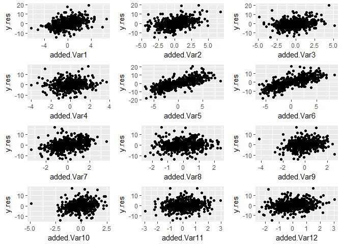

Simulation for Added Variable Plot then Variable Importance Scheme
================
Emerson Webb
3/14/2018

``` r
library(randomForest)
```

    ## randomForest 4.6-12

    ## Type rfNews() to see new features/changes/bug fixes.

``` r
library(tidyverse)
```

    ## -- Attaching packages --------------------------------------------------------------------------------- tidyverse 1.2.1 --

    ## v ggplot2 2.2.1     v purrr   0.2.4
    ## v tibble  1.3.4     v dplyr   0.7.4
    ## v tidyr   0.7.2     v stringr 1.3.0
    ## v readr   1.1.1     v forcats 0.2.0

    ## -- Conflicts ------------------------------------------------------------------------------------ tidyverse_conflicts() --
    ## x dplyr::combine()  masks randomForest::combine()
    ## x dplyr::filter()   masks stats::filter()
    ## x dplyr::lag()      masks stats::lag()
    ## x ggplot2::margin() masks randomForest::margin()

``` r
library(grid)
library(gridExtra)
```

    ## 
    ## Attaching package: 'gridExtra'

    ## The following object is masked from 'package:dplyr':
    ## 
    ##     combine

    ## The following object is masked from 'package:randomForest':
    ## 
    ##     combine

``` r
library(mvtnorm)
library(partykit)
```

    ## Loading required package: libcoin

    ## Loading required package: rpart

Next want to write a function which takes a dataframe and applys the added-variable plot then permute scheme to each predictor in the dataset.

``` r
#first need to take our data frame and make the p+1 datasets that we apply the random forest to

#itr_col takes as input an integer and removes that column from the dataset
#note: should make itr_col more robust
itr_col <- function(i, data){
  select(data,-i)
}

#df_combs is a function which takes as input a dataframe and returns all iterations of the
#dataframe where one predictor has been removed. Output is a p+1 element list where each element
#is a dataframe with the ith variable removed. the last element of the list is the entire dataframe
df_combs <- function(data){
  p <- ncol(data)-1
  df.list <- map(1:p, itr_col, data = data)
  df.list[[p+1]] <- data
  df.list
}

#extract_rf_pred is a function which takes as input a list of randomforest objects, an index value, 
#and the number of predictors in the model and outputs the predicted values of the random forest in 
#a dataframe. extract_rf_pred is mainly for use in map_dfc, which binds by column the predicted values in 
#data.list as a dataframe. Primarily for use in each_pred_rf
extract_rf_pred <- function(i, data.list, p){
 new.df <- as.data.frame(data.list[[i]]$predicted) 
 colnames(new.df) <- ifelse(i <= p, paste("PredWoVar", as.character(i), sep = ""),
                            "PredFullMod")
 new.df
}

#each_pred_rf is a function whose input is a list of dataframes that come from output of df_combs and runs the 
#randomForest function on each dataframe using the map function. Output is dataframe of predicted values along with actual value of Y as last column. Second to last column is the predicted value of full model. 
each_pred_rf <- function(data.list, ntree1, replace = TRUE){
  p <- length(data.list)-1
  rf.list <- map(.x = data.list, function(x) 
    randomForest(Y~., data = x, ntree = ntree1, replace = replace, importance = TRUE))
  rf.df <- map_dfc(1:(p+1), extract_rf_pred, data.list = rf.list, p = p)
  Y <- data.list[[1]]$Y
  new.df <- cbind(rf.df, Y)
  imp <- importance(rf.list[[p+1]])
  list(new.df, imp)
}


#extract_add_var takes as input an index value and data frame and 
#outputs a dataframe of the basic added variable data frame where 
#x.res is the difference between predicted values of full model and 
#predicted values of model with out jth variable
#y.res is the residual of Y and predicted values of model without jth variable.
#For use with map in rf_add_var
extract_add_var <-function(i, df){
  PredFullMod <- as.name("PredFullMod")
  Y <- as.name("Y")
  V <- as.name(paste("PredWoVar", as.character(i), sep =""))
  x.res <- df[[PredFullMod]]-df[[V]]
  y.res <- df[[Y]]-df[[V]]
  new.df <- data.frame(x.res, y.res)
  colnames(new.df) <- c(paste("diff.full.woVar", as.character(i), sep = ""), "y.res")
  new.df
}

#rf_add_var takes as input the output of each_pred_rf and outputs a list of length p 
#in which each entry is a data frame corresponding to an added variable plot for the jth predictor in the 
#data set.
rf_add_var <- function(data.list){
  rf.df <- data.list[[1]]
  p <- length(rf.df)-2
  add.var.list <- map(1:p, extract_add_var, df = rf.df)
  add.var.list
}

#rf_add_var_imp takes as input a list of add_var df's from rf_add_var and runs
#a random forest on the y-residuals with x-residuals as input.
#output is a list of random forest objects. Might change output to be just variable importance values. 
rf_add_var_imp <- function(data.list, ntree2, replace = TRUE){
  p <- length(data.list)
  rf.add.imp.list <- map(.x = data.list, function(x) 
    randomForest(y.res~., data = x, ntree = ntree2, replace = replace, importance = TRUE))
  rf.add.imp.list
}

extract_imp <-function(i, data.list){
  new.df <- as.data.frame(t(importance(data.list[[i]])))
  new.df
}

extract_var_imp <- function(data.list){
  p <- length(data.list)
  new.df <- map_dfc(1:p, extract_imp, data.list = data.list)
  rownames(new.df) <- c("%IncMSE", "IncNodePurity")
  as.data.frame(t(new.df))
}


#add_var_randomforest is a wrapper for the previous functions
add_var_randomforest <- function(data, ntree1, ntree2, replace = TRUE){
  #to get the copy of the data with one predictor removed
  df.list <- df_combs(data)
  #running initial randomFoest on each data frame
  rf.list <- each_pred_rf(df.list, ntree1 = ntree1)
  #tidying the data to compute added variable plots
  rf.add.var.list <- rf_add_var(rf.list)
  #running randomForests on each plot
  rf.add.imp.list <- rf_add_var_imp(rf.add.var.list, ntree2 = ntree2)
  #extracts variable importance values for each randomForest ran on added variable plots
  add.var.imp <- extract_var_imp(rf.add.imp.list)
  #output is list containing data frame of added variable plot variable importances, 
  #rf.add.var.list which are dataframe for added variable plots, and 
  #the variable importances from full model run in each_pred_rf
  list(add.var.imp, rf.add.var.list, rf.list[[2]])
}


#input for rf_added_var_plot is output of 
#add_var_randomforest. Output is plot of added variable plots for 
#the random forest arranged in a grid.

plot_add_var <- function(i, df.list){
  df <- df.list[[i]]
  x.name <- colnames(df)[1]
  y.name <- colnames(df)[2]
  plot.obj <- ggplot(df, aes_string(x = x.name, y = y.name))+geom_point()
  plot.obj
}

rf_added_var_plot <- function(data.list){
    df.list <- data.list[[2]]
    p <- length(df.list)
    gg.list <- map(1:p, plot_add_var, df.list = df.list)
    nCol <- floor(sqrt(p))
    do.call("grid.arrange", c(gg.list, ncol = nCol))
}
```

Now ready to run simulations. First and second simulated datasets are from Strobl (2008). First simulated dataset is Strobl's with iid variables. Second simulated dataset is Strobl's with correlated variables. Both are cases of a response in which the effect of added variables is linear.

``` r
set.seed(19)
#iid
#n1 is number of observations in dataset
n1 <- 2000
#p1 is number of variables
p1 <- 12
#our weights are given by wt_vec <- c(5,5,2,0,-5,-5,-2,0,0,0,0,0) 
err1 <- rnorm(n1, mean = 0, sd = 0.5)
siml.data1 <- as.data.frame(matrix(rnorm(n1*p1, mean = 0, sd = 1), nrow = n1))
siml.data1 <- siml.data1 %>% 
  mutate(Y = 5*V1+5*V2+2*V3+-5*V5+-5*V6+-2*V7+err1)

#correlated
#n2 is number of observations in dataset
n2 <- 2000
#p2 is number of variables
#p2 <- 12
#our weights are given by wt_vec <- c(5,5,2,0,-5,-5,-2,0,0,0,0,0) 
#covariance matrix
v1 <- c(1,0.9,0.9,0.9)
v2 <- c(0.9,1,0.9,0.9)
v3 <- c(0.9,0.9,1,0.9)
v4 <- c(0.9,0.9,0.9,1)
w <- rep(0, times = 8)
u1 <- c(rep(0, times = 4), 1, rep(0, times = 7))
u2 <- c(rep(0, times = 5), 1, rep(0, times = 6))
u3 <- c(rep(0, times = 6), 1, rep(0, times = 5))
u4 <- c(rep(0, times = 7), 1, rep(0, times = 4))
u5 <- c(rep(0, times = 8), 1, rep(0, times = 3))
u6 <- c(rep(0, times = 9), 1, 0,0)
u7 <- c(rep(0, times = 10), 1, 0)
u8 <- c(rep(0, times = 11), 1)

Sigma2 <- matrix(c(v1,w,v2,w,v3,w,v4,w,
                   u1,u2,u3,u4,u5,u6,u7,u8), nrow = 12, ncol = 12)
err2 <- rnorm(n2, mean = 0, sd = 0.5)
siml.data2 <- as.data.frame(rmvnorm(n = n2, mean = rep(0, times = 12), sigma = Sigma2))
siml.data2 <- siml.data2 %>% 
  mutate(Y = 5*V1+5*V2+2*V3+-5*V5+-5*V6+-2*V7+err2)

#run the simulations with and without replacement for bootstrapping
siml1.wrep.results <- add_var_randomforest(data = siml.data1, ntree1 = 100, ntree2 = 100)
siml1.worep.results <- add_var_randomforest(data = siml.data1, ntree1 = 100, ntree2 = 100, replace = FALSE)
siml2.wrep.results <- add_var_randomforest(data = siml.data2, ntree1 = 100, ntree2 = 100)
siml2.worep.results <- add_var_randomforest(data = siml.data2, ntree1 = 100, ntree2 = 100, replace = FALSE)
```

``` r
siml1.wrep.results[[1]]
```

    ##                      %IncMSE IncNodePurity
    ## diff.full.woVar1  151.480458      61097.48
    ## diff.full.woVar2  137.046595      65392.39
    ## diff.full.woVar3   43.079316      29867.95
    ## diff.full.woVar4   14.093522      24937.81
    ## diff.full.woVar5  146.946773      64957.45
    ## diff.full.woVar6  129.351637      64200.78
    ## diff.full.woVar7   35.769773      28377.50
    ## diff.full.woVar8   14.822093      24616.15
    ## diff.full.woVar9   11.382573      24024.64
    ## diff.full.woVar10   6.187614      23928.48
    ## diff.full.woVar11  10.496273      23101.10
    ## diff.full.woVar12  22.076629      25062.49

``` r
siml1.wrep.results[[3]]
```

    ##        %IncMSE IncNodePurity
    ## V1  55.1618246     38480.723
    ## V2  54.1693739     41139.844
    ## V3  14.1813896      8497.334
    ## V4  -0.1109081      3116.402
    ## V5  58.1379599     47146.309
    ## V6  61.8271905     44128.883
    ## V7  13.0606651      6830.296
    ## V8   0.1447217      3121.762
    ## V9  -1.6777732      3150.158
    ## V10 -0.4058091      2831.794
    ## V11 -1.2417038      3438.550
    ## V12 -0.1044953      3105.547

``` r
rf_added_var_plot(siml1.wrep.results)
```


Above are results for the first simulated dataset with replacement. The added variable plot does seem to be useful in capturing linear relationships, even with using the random forest mechanism. In terms of variable importance scores, the original forest performs better. Part of this seems to be that even non-significant variables will be assigned a non-trivial importance scores within the forest that splits only on the difference between the full model and the model excluding the particular variable.

``` r
siml1.worep.results[[1]]
```

    ##                     %IncMSE IncNodePurity
    ## diff.full.woVar1  140.53205      62818.80
    ## diff.full.woVar2  126.33997      64264.84
    ## diff.full.woVar3   45.58884      29446.39
    ## diff.full.woVar4   18.33739      24068.07
    ## diff.full.woVar5  134.73966      63969.96
    ## diff.full.woVar6  136.87106      64557.99
    ## diff.full.woVar7   46.08258      26861.23
    ## diff.full.woVar8   27.71520      25520.84
    ## diff.full.woVar9   23.83993      25107.05
    ## diff.full.woVar10  13.46811      24236.32
    ## diff.full.woVar11  20.25531      24105.77
    ## diff.full.woVar12  18.31525      24074.72

``` r
siml1.worep.results[[3]]
```

    ##         %IncMSE IncNodePurity
    ## V1  59.89456471     37091.687
    ## V2  62.80373631     42660.920
    ## V3  14.63621677      8701.976
    ## V4   0.56915691      2943.609
    ## V5  60.14328843     47108.932
    ## V6  56.96738505     43973.228
    ## V7  14.13907070      7083.175
    ## V8  -0.07073259      3208.400
    ## V9  -1.71814713      2931.446
    ## V10  2.06756657      3061.051
    ## V11 -2.64180508      3325.112
    ## V12 -0.94799096      3022.216

``` r
rf_added_var_plot(siml1.worep.results)
```


Sampling without replacement as opposed to bootstrap withreplacement seems to improve performance of added variable then variable importance scheme. Overall, if the variables are independent, then the random forest variable importance score seems quite reliable.

``` r
siml2.wrep.results[[1]]
```

    ##                     %IncMSE IncNodePurity
    ## diff.full.woVar1   53.96799      23360.39
    ## diff.full.woVar2   62.67005      25816.65
    ## diff.full.woVar3   27.69125      20136.38
    ## diff.full.woVar4   12.79959      18376.27
    ## diff.full.woVar5  147.40177      59425.95
    ## diff.full.woVar6  164.85449      64107.45
    ## diff.full.woVar7   60.56654      24551.90
    ## diff.full.woVar8   19.75925      19279.41
    ## diff.full.woVar9   29.52837      20221.32
    ## diff.full.woVar10  19.95494      19108.51
    ## diff.full.woVar11  20.29544      18994.32
    ## diff.full.woVar12  26.73365      20670.37

``` r
siml2.wrep.results[[3]]
```

    ##          %IncMSE IncNodePurity
    ## V1  13.855847256     83083.326
    ## V2  13.945572932     90206.825
    ## V3  10.614734644     62139.029
    ## V4   8.011674979     38832.042
    ## V5  65.584657268     36705.544
    ## V6  75.347633182     41501.350
    ## V7  14.690904606      6834.994
    ## V8   1.366727211      2478.902
    ## V9   0.167181708      2455.313
    ## V10 -1.541766920      2436.681
    ## V11 -0.006232601      2272.058
    ## V12 -0.549683832      2515.435

``` r
rf_added_var_plot(siml2.wrep.results)
```


With correlated predictors, the added variable plots does seem to improve the performance of the variable importance somewhat. Variables 1 through 4 are correlated, so their raw variable importance score is dampened by that fact. When using added variable then variable importance scheme, variable 1 and 2 look particularly important, which we expect. The score for variable 3 increases, but the scoresfor variables 8 through 12 also increase.

``` r
siml2.worep.results[[1]]
```

    ##                      %IncMSE IncNodePurity
    ## diff.full.woVar1   53.630180      24082.93
    ## diff.full.woVar2   56.816047      24901.32
    ## diff.full.woVar3   18.391172      20176.21
    ## diff.full.woVar4    7.417208      18171.94
    ## diff.full.woVar5  133.065684      58979.71
    ## diff.full.woVar6  140.903680      62989.45
    ## diff.full.woVar7   49.566611      23968.20
    ## diff.full.woVar8   16.154599      19090.11
    ## diff.full.woVar9   24.656370      19781.32
    ## diff.full.woVar10  16.420055      19348.67
    ## diff.full.woVar11  26.196830      20186.33
    ## diff.full.woVar12  17.298064      18617.37

``` r
siml2.worep.results[[3]]
```

    ##        %IncMSE IncNodePurity
    ## V1  12.0511857     68940.787
    ## V2  14.9072961    109091.149
    ## V3   9.6221119     55269.624
    ## V4   7.8036449     42475.162
    ## V5  68.4107856     37939.928
    ## V6  69.1077987     39998.807
    ## V7  17.4368183      6677.803
    ## V8   1.9820846      2316.126
    ## V9  -0.4662079      2408.340
    ## V10 -0.8207500      2339.191
    ## V11  0.1656152      2371.415
    ## V12  0.4901610      2491.443

``` r
rf_added_var_plot(siml2.worep.results)
```



Sampling without replacement improves the performance of the added variable then variable importance scheme, although the issue of irrelvant variables (particularly variables 8 through 12) persists.

``` r
#independent variables with a non-linear response
#n3 is number of observations
n3 <- 2000
#p3 is numberof variables
p3 <- 12
#some error to add in 
err3 <- rnorm(n3, mean = 0, sd = 0.5)
siml.data3 <- as.data.frame(matrix(rnorm(n3*p3, mean = 0, sd = 1), nrow = n3))
siml.data3 <- siml.data3 %>% 
  mutate(Y = 5*V1^4+5*V2^3+2*V3^4+err3)

#correlated variables with a non-linear response
n4 <- 2000
err4 <- rnorm(n4, mean = 0, sd = 0.5)
siml.data4 <- as.data.frame(rmvnorm(n = n4, mean = rep(0, times = 12), sigma = Sigma2))
siml.data4 <- siml.data4 %>%
  mutate(Y = 5*V1^4+5*V2^3+2*V3^4+err3)

siml3.wrep.results <- add_var_randomforest(data = siml.data3, ntree1 = 100, ntree2 = 100)
siml3.worep.results <- add_var_randomforest(data = siml.data3, ntree1 = 100, ntree2 = 100, replace = FALSE)
siml4.wrep.results <- add_var_randomforest(data = siml.data4, ntree1 = 100, ntree2 = 100)
siml4.worep.results <- add_var_randomforest(data = siml.data4, ntree1 = 100, ntree2 = 100, replace = FALSE)
```
