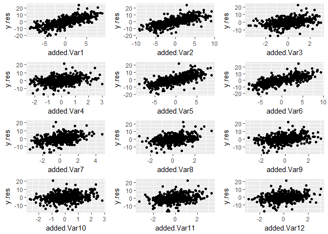
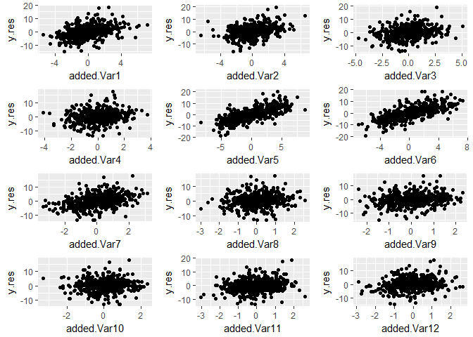

Simulation for Added Variable Plot then Variable Importance Scheme
================
Emerson Webb
3/14/2018

``` r
library(randomForest)
```

    ## randomForest 4.6-12

    ## Type rfNews() to see new features/changes/bug fixes.

``` r
library(tidyverse)
```

    ## -- Attaching packages --------------------------------------------------------------------------------- tidyverse 1.2.1 --

    ## v ggplot2 2.2.1     v purrr   0.2.4
    ## v tibble  1.3.4     v dplyr   0.7.4
    ## v tidyr   0.7.2     v stringr 1.3.0
    ## v readr   1.1.1     v forcats 0.2.0

    ## -- Conflicts ------------------------------------------------------------------------------------ tidyverse_conflicts() --
    ## x dplyr::combine()  masks randomForest::combine()
    ## x dplyr::filter()   masks stats::filter()
    ## x dplyr::lag()      masks stats::lag()
    ## x ggplot2::margin() masks randomForest::margin()

``` r
library(grid)
library(gridExtra)
```

    ## 
    ## Attaching package: 'gridExtra'

    ## The following object is masked from 'package:dplyr':
    ## 
    ##     combine

    ## The following object is masked from 'package:randomForest':
    ## 
    ##     combine

``` r
library(mvtnorm)
```

Here we create simulated data used to test the code.

``` r
#n is number of observations in dataset
n <- 1000
#p is number of variables
p <- 5
#our weights are given by wt_vec <- c(5,5,1,0,0)
err <- rnorm(n, mean = 0, sd = 0.05)
siml.data <- as.data.frame(matrix(rnorm(n*p, mean = 0, sd = 1), nrow = n))
siml.data <- siml.data %>% 
  mutate(Y = 5*V1+5*V2+V3+err)
```

Next want to write a function which takes a dataframe and applys the added-variable plot then permute scheme to each predictor in the dataset.

``` r
#first need to take our data frame and make the p+1 datasets that we apply the random forest to

#itr_col takes as input an integer and removes that column from the dataset
#note: should make itr_col more robust
itr_col <- function(i, data){
  select(data,-i)
}

#df_combs is a function which takes as input a dataframe and returns all iterations of the
#dataframe where one predictor has been removed. Output is a p+1 element list where each element
#is a dataframe with the ith variable removed. the last element of the list is the entire dataframe
df_combs <- function(data){
  p <- ncol(data)-1
  df.list <- map(1:p, itr_col, data = data)
  df.list[[p+1]] <- data
  df.list
}

#extract_rf_pred is a function which takes as input a list of randomforest objects, an index value, 
#and the number of predictors in the model and outputs the predicted values of the random forest in 
#a dataframe. extract_rf_pred is mainly for use in map_dfc, which binds by column the predicted values in 
#data.list as a dataframe. Primarily for use in each_pred_rf
extract_rf_pred <- function(i, data.list, p){
 new.df <- as.data.frame(data.list[[i]]$predicted) 
 colnames(new.df) <- ifelse(i <= p, paste("PredWoVar", as.character(i), sep = ""),
                            "PredFullMod")
 new.df
}

#each_pred_rf is a function whose input is a list of dataframes that come from output of df_combs and runs the 
#randomForest function on each dataframe using the map function. Output is dataframe of predicted values along with actual value of Y as last column. Second to last column is the predicted value of full model. 
each_pred_rf <- function(data.list, ntree1, replace = TRUE){
  p <- length(data.list)-1
  rf.list <- map(.x = data.list, function(x) 
    randomForest(Y~., data = x, ntree = ntree1, replace = replace, importance = TRUE))
  rf.df <- map_dfc(1:(p+1), extract_rf_pred, data.list = rf.list, p = p)
  Y <- data.list[[1]]$Y
  new.df <- cbind(rf.df, Y)
  imp <- importance(rf.list[[p+1]])
  list(new.df, imp)
}


#extract_add_var takes as input an index value and data frame and 
#outputs a dataframe of the basic added variable data frame where 
#x.res is the difference between predicted values of full model and 
#predicted values of model with out jth variable
#y.res is the residual of Y and predicted values of model without jth variable.
#For use with map in rf_add_var
extract_add_var <-function(i, df){
  PredFullMod <- as.name("PredFullMod")
  Y <- as.name("Y")
  V <- as.name(paste("PredWoVar", as.character(i), sep =""))
  x.res <- df[[PredFullMod]]-df[[V]]
  y.res <- df[[Y]]-df[[V]]
  new.df <- data.frame(x.res, y.res)
  colnames(new.df) <- c(paste("diff.full.woVar", as.character(i), sep = ""), "y.res")
  new.df
}

#rf_add_var takes as input the output of each_pred_rf and outputs a list of length p 
#in which each entry is a data frame corresponding to an added variable plot for the jth predictor in the 
#data set.
rf_add_var <- function(data.list){
  rf.df <- data.list[[1]]
  p <- length(rf.df)-2
  add.var.list <- map(1:p, extract_add_var, df = rf.df)
  add.var.list
}

#rf_add_var_imp takes as input a list of add_var df's from rf_add_var and runs
#a random forest on the y-residuals with x-residuals as input.
#output is a list of random forest objects. Might change output to be just variable importance values. 
rf_add_var_imp <- function(data.list, ntree2, replace = TRUE){
  p <- length(data.list)
  rf.add.imp.list <- map(.x = data.list, function(x) 
    randomForest(y.res~., data = x, ntree = ntree2, replace = replace, importance = TRUE))
  rf.add.imp.list
}

extract_imp <-function(i, data.list){
  new.df <- as.data.frame(t(importance(data.list[[i]])))
  new.df
}

extract_var_imp <- function(data.list){
  p <- length(data.list)
  new.df <- map_dfc(1:p, extract_imp, data.list = data.list)
  rownames(new.df) <- c("%IncMSE", "IncNodePurity")
  as.data.frame(t(new.df))
}


#add_var_randomforest is a wrapper for the previous functions
add_var_randomforest <- function(data, ntree1, ntree2, replace = TRUE){
  #to get the copy of the data with one predictor removed
  df.list <- df_combs(data)
  #running initial randomFoest on each data frame
  rf.list <- each_pred_rf(df.list, ntree1 = ntree1)
  #tidying the data to compute added variable plots
  rf.add.var.list <- rf_add_var(rf.list)
  #running randomForests on each plot
  rf.add.imp.list <- rf_add_var_imp(rf.add.var.list, ntree2 = ntree2)
  #extracts variable importance values for each randomForest ran on added variable plots
  add.var.imp <- extract_var_imp(rf.add.imp.list)
  #output is list containing data frame of added variable plot variable importances, 
  #rf.add.var.list which are dataframe for added variable plots, and 
  #the variable importances from full model run in each_pred_rf
  list(add.var.imp, rf.add.var.list, rf.list[[2]])
}


#input for rf_added_var_plot is output of 
#add_var_randomforest. Output is plot of added variable plots for 
#the random forest arranged in a grid.

plot_add_var <- function(i, df.list){
  df <- df.list[[i]]
  x.name <- colnames(df)[1]
  y.name <- colnames(df)[2]
  plot.obj <- ggplot(df, aes_string(x = x.name, y = y.name))+geom_point()
  plot.obj
}

rf_added_var_plot <- function(data.list){
    df.list <- data.list[[2]]
    p <- length(df.list)
    gg.list <- map(1:p, plot_add_var, df.list = df.list)
    nCol <- floor(sqrt(p))
    do.call("grid.arrange", c(gg.list, ncol = nCol))
}

#Now to test
rf.add.var.imp <- add_var_randomforest(siml.data, ntree1 = 1000, ntree2 = 1000, replace = FALSE)
rf.add.var.imp[[1]]
```

    ##                    %IncMSE IncNodePurity
    ## diff.full.woVar1 390.23532     28192.408
    ## diff.full.woVar2 368.86003     26232.065
    ## diff.full.woVar3  14.98978      3555.670
    ## diff.full.woVar4 125.56842      3129.589
    ## diff.full.woVar5 131.09600      3119.439

``` r
rf.add.var.imp[[3]]
```

    ##        %IncMSE IncNodePurity
    ## V1 138.4617795     19917.907
    ## V2 133.5180903     19455.061
    ## V3  21.2823159      3866.079
    ## V4   0.1098482      3341.200
    ## V5   1.4988053      3439.388

``` r
rf_added_var_plot(rf.add.var.imp)
```


Now ready to run simulations. First and second simulated datasets are from Strobl (2008). First simulated dataset is Strobl's with iid variables. Second simulated dataset is Strobl's with correlated variables. Both are cases of a response in which the effect of added variables is linear.

``` r
set.seed(17)
#iid
#n1 is number of observations in dataset
n1 <- 2000
#p1 is number of variables
p1 <- 12
#our weights are given by wt_vec <- c(5,5,2,0,-5,-5,-2,0,0,0,0,0) 
err1 <- rnorm(n1, mean = 0, sd = 0.5)
siml.data1 <- as.data.frame(matrix(rnorm(n1*p1, mean = 0, sd = 1), nrow = n1))
siml.data1 <- siml.data1 %>% 
  mutate(Y = 5*V1+5*V2+2*V3+-5*V5+-5*V6+-2*V7+err1)

#correlated
#n2 is number of observations in dataset
n2 <- 2000
#p2 is number of variables
#p2 <- 12
#our weights are given by wt_vec <- c(5,5,2,0,-5,-5,-2,0,0,0,0,0) 
#covariance matrix
v1 <- c(1,0.9,0.9,0.9)
v2 <- c(0.9,1,0.9,0.9)
v3 <- c(0.9,0.9,1,0.9)
v4 <- c(0.9,0.9,0.9,1)
w <- rep(0, times = 8)
u1 <- c(rep(0, times = 4), 1, rep(0, times = 7))
u2 <- c(rep(0, times = 5), 1, rep(0, times = 6))
u3 <- c(rep(0, times = 6), 1, rep(0, times = 5))
u4 <- c(rep(0, times = 7), 1, rep(0, times = 4))
u5 <- c(rep(0, times = 8), 1, rep(0, times = 3))
u6 <- c(rep(0, times = 9), 1, 0,0)
u7 <- c(rep(0, times = 10), 1, 0)
u8 <- c(rep(0, times = 11), 1)

Sigma2 <- matrix(c(v1,w,v2,w,v3,w,v4,w,
                   u1,u2,u3,u4,u5,u6,u7,u8), nrow = 12, ncol = 12)
err2 <- rnorm(n2, mean = 0, sd = 0.5)
siml.data2 <- as.data.frame(rmvnorm(n = n2, mean = rep(0, times = 12), sigma = Sigma2))
siml.data2 <- siml.data2 %>% 
  mutate(Y = 5*V1+5*V2+2*V3+-5*V5+-5*V6+-2*V7+err2)

#run the simulations with and without replacement for bootstrapping
siml1.wrep.results <- add_var_randomforest(data = siml.data1, ntree1 = 1000, ntree2 = 1000)
siml1.worep.results <- add_var_randomforest(data = siml.data1, ntree1 = 1000, ntree2 = 1000, replace = FALSE)
siml2.wrep.results <- add_var_randomforest(data = siml.data2, ntree1 = 1000, ntree2 = 1000)
siml2.worep.results <- add_var_randomforest(data = siml.data2, ntree1 = 1000, ntree2 = 1000, replace = FALSE)
```

``` r
siml1.wrep.results[[1]]
```

    ##                     %IncMSE IncNodePurity
    ## diff.full.woVar1  447.00001      60582.45
    ## diff.full.woVar2  451.07389      62221.95
    ## diff.full.woVar3  208.12668      27131.27
    ## diff.full.woVar4   88.00969      22513.09
    ## diff.full.woVar5  445.51396      65087.82
    ## diff.full.woVar6  448.10582      63116.95
    ## diff.full.woVar7  185.23571      27035.50
    ## diff.full.woVar8   93.66242      22766.69
    ## diff.full.woVar9  106.41798      22814.32
    ## diff.full.woVar10  92.24011      22913.78
    ## diff.full.woVar11  91.69804      22458.87
    ## diff.full.woVar12  62.79635      22395.43

``` r
siml1.wrep.results[[3]]
```

    ##         %IncMSE IncNodePurity
    ## V1  182.4024425     41137.979
    ## V2  184.5510571     45588.825
    ## V3   45.9585109      8508.968
    ## V4    0.1073602      3084.318
    ## V5  190.6111824     48206.739
    ## V6  186.5662496     46369.445
    ## V7   48.9457409      8954.066
    ## V8    1.9179655      3359.988
    ## V9   -1.6537933      3107.048
    ## V10   0.6689461      3113.626
    ## V11   2.2670778      3148.047
    ## V12  -1.9263215      3173.096

``` r
rf_added_var_plot(siml1.wrep.results)
```



Above are results for the first simulated dataset with replacement. The added variable plot does seem to be useful in capturing linear relationships, even with using the random forest mechanism. In terms of variable importance scores, the original forest performs better. Part of this seems to be that even non-significant variables will be assigned a non-trivial importance scores within the forest that splits only on the difference between the full model and the model excluding the particular variable.

``` r
siml1.worep.results[[1]]
```

    ##                     %IncMSE IncNodePurity
    ## diff.full.woVar1  441.62278      60798.99
    ## diff.full.woVar2  425.21266      62549.46
    ## diff.full.woVar3  203.12488      27350.78
    ## diff.full.woVar4   78.82870      22235.12
    ## diff.full.woVar5  431.03311      65157.95
    ## diff.full.woVar6  419.73008      63035.36
    ## diff.full.woVar7  166.05736      26990.49
    ## diff.full.woVar8   44.23605      22297.66
    ## diff.full.woVar9   71.92639      22699.17
    ## diff.full.woVar10  79.26814      22367.28
    ## diff.full.woVar11  65.18359      22821.87
    ## diff.full.woVar12  35.92041      22021.40

``` r
siml1.worep.results[[3]]
```

    ##         %IncMSE IncNodePurity
    ## V1  180.5655822     40858.151
    ## V2  185.4561228     45127.522
    ## V3   44.4634791      8587.555
    ## V4    0.5572903      3055.010
    ## V5  190.3865123     48040.951
    ## V6  194.1086182     47246.511
    ## V7   45.6542278      8994.928
    ## V8    0.4373809      3337.020
    ## V9   -1.9731465      3196.861
    ## V10  -1.3363363      3099.261
    ## V11   0.5162924      3171.471
    ## V12  -1.9460968      3211.690

``` r
rf_added_var_plot(siml1.worep.results)
```


Sampling without replacement as opposed to bootstrap withreplacement seems to improve performance of added variable then variable importance scheme. Overall, if the variables are independent, then the random forest variable importance score seems quite reliable.

``` r
siml2.wrep.results[[1]]
```

    ##                     %IncMSE IncNodePurity
    ## diff.full.woVar1  187.47102      22797.54
    ## diff.full.woVar2  201.92556      23258.79
    ## diff.full.woVar3   63.99812      17569.36
    ## diff.full.woVar4  -15.19825      15791.52
    ## diff.full.woVar5  481.55811      58128.79
    ## diff.full.woVar6  478.51529      58600.73
    ## diff.full.woVar7  244.81204      22118.41
    ## diff.full.woVar8  109.03339      17778.07
    ## diff.full.woVar9   93.43999      17667.41
    ## diff.full.woVar10  60.02724      17726.29
    ## diff.full.woVar11  90.37560      17772.45
    ## diff.full.woVar12  95.77122      17794.38

``` r
siml2.wrep.results[[3]]
```

    ##         %IncMSE IncNodePurity
    ## V1   43.5255111     90556.145
    ## V2   44.2150846     91167.031
    ## V3   31.6072340     50002.114
    ## V4   22.2967393     32777.536
    ## V5  206.9312865     35095.789
    ## V6  212.8278553     38180.438
    ## V7   55.8753937      6787.763
    ## V8    2.3794319      2501.720
    ## V9    2.1045008      2477.657
    ## V10   0.2851840      2552.527
    ## V11  -0.1671618      2469.380
    ## V12   0.2430819      2437.085

``` r
rf_added_var_plot(siml2.wrep.results)
```


With correlated predictors, the added variable plots does seem to improve the performance of the variable importance somewhat. Variables 1 through 4 are correlated, so their raw variable importance score is dampened by that fact. When using added variable then variable importance scheme, variable 1 and 2 look particularly important, which we expect. The score for variable 3 increases, but the scoresfor variables 8 through 12 also increase.

``` r
siml2.worep.results[[1]]
```

    ##                     %IncMSE IncNodePurity
    ## diff.full.woVar1  170.92293      22488.75
    ## diff.full.woVar2  176.12058      23158.73
    ## diff.full.woVar3   51.80303      17620.44
    ## diff.full.woVar4   17.94338      16272.12
    ## diff.full.woVar5  491.11457      58393.60
    ## diff.full.woVar6  467.23774      58899.03
    ## diff.full.woVar7  232.48979      22121.80
    ## diff.full.woVar8   69.33822      17485.08
    ## diff.full.woVar9   79.09867      17609.26
    ## diff.full.woVar10  77.89223      17714.46
    ## diff.full.woVar11  65.52273      17384.84
    ## diff.full.woVar12  62.57975      17481.96

``` r
siml2.worep.results[[3]]
```

    ##        %IncMSE IncNodePurity
    ## V1   43.673721     90174.052
    ## V2   42.445299     89843.242
    ## V3   31.488010     50758.376
    ## V4   22.209697     33919.995
    ## V5  205.857545     35076.602
    ## V6  204.784563     37890.953
    ## V7   52.816276      6869.272
    ## V8   -0.464739      2503.051
    ## V9    2.534092      2496.812
    ## V10  -1.109370      2537.270
    ## V11  -1.055568      2489.947
    ## V12  -2.219981      2439.331

``` r
rf_added_var_plot(siml2.worep.results)
```



Sampling without replacement improves the performacne of the added variable then variable importance scheme, although the issue of irrelvant variables (particularly variables 8 through 12) persists.
